# chunky.fm

A single, permanent internet radio station for a small room: one set of decks,
one shared clock, and around thirty listeners who hear the same second of the
same record at the same moment.

The station does not stream audio. It broadcasts a small piece of state, and
every listener's browser plays the file itself, aligned to the station's clock.
Everything else in this document follows from that one decision.

Design decisions and the original scope live in [PLAN.md](PLAN.md). This file
describes the system as built.

---

## Contents

1. [The core idea](#the-core-idea)
2. [Deployment topology](#deployment-topology)
3. [The front door](#the-front-door)
4. [Server architecture](#server-architecture)
5. [Data model](#data-model)
6. [Identity and authorisation](#identity-and-authorisation)
7. [HTTP API](#http-api)
8. [Realtime protocol](#realtime-protocol)
9. [Playback, scheduling and transitions](#playback-scheduling-and-transitions)
10. [Clock synchronisation and drift](#clock-synchronisation-and-drift)
11. [Client architecture](#client-architecture)
12. [Audio pipeline](#audio-pipeline)
13. [Voice: mic, call-in and co-host](#voice-mic-call-in-and-co-host)
14. [Session lifecycle](#session-lifecycle)
15. [Uploads, library and lyrics](#uploads-library-and-lyrics)
16. [The podcast archive](#the-podcast-archive)
17. [Configuration reference](#configuration-reference)
18. [Running the station](#running-the-station)
19. [Testing and CI](#testing-and-ci)
20. [Deployment](#deployment)
21. [System invariants](#system-invariants)
22. [Repository layout](#repository-layout)

---

## The core idea

A conventional internet station encodes audio on the server and pushes bytes to
every listener. chunky.fm does not. The server holds a three-field tuple in
memory and broadcasts it:

```ts
{ track, startedAt, pausedAt }
```

Position is `pausedAt ?? (serverNow - startedAt)`. Because `startedAt` is a
point in the past, a listener joining at 2:14 takes exactly the same code path
as one joining at 0:00. There is no per-listener state, no transcode, no
mixing, and no fan-out cost proportional to bitrate.

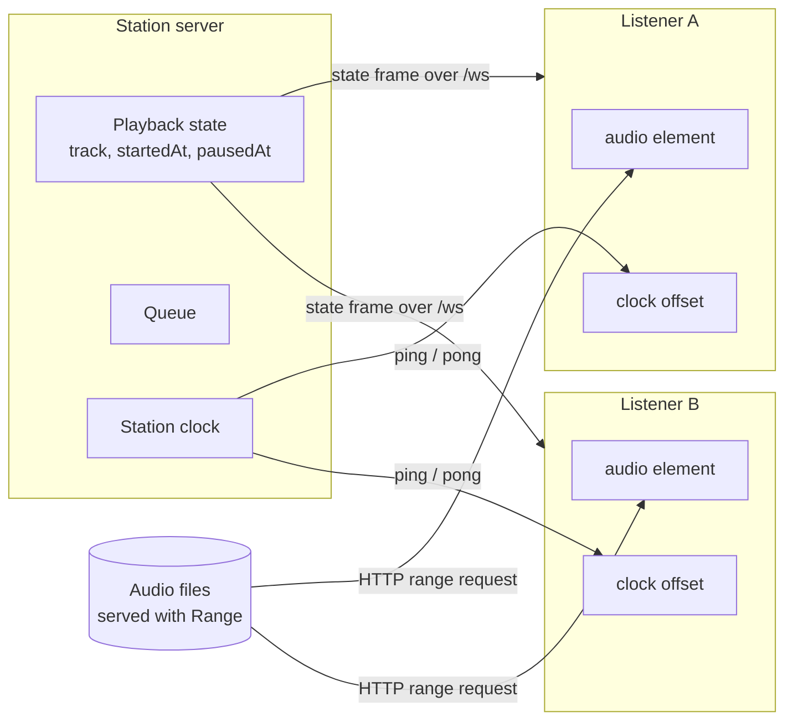
```mermaid
flowchart LR
    subgraph Server["Station server"]
        S["Playback state<br/>track, startedAt, pausedAt"]
        Q["Queue"]
        C["Station clock"]
    end

    subgraph L1["Listener A"]
        A1["audio element"]
        A2["clock offset"]
    end
    subgraph L2["Listener B"]
        B1["audio element"]
        B2["clock offset"]
    end

    F[("Audio files<br/>served with Range")]

    S -- "state frame over /ws" --> L1
    S -- "state frame over /ws" --> L2
    C -- "ping / pong" --> A2
    C -- "ping / pong" --> B2
    F -- "HTTP range request" --> A1
    F -- "HTTP range request" --> B1
```

Three consequences run through the whole system:

| Consequence | Detail |
|---|---|
| The server never mixes | Ducking under a voice, crossfading between records and per-listener volume are all client-side gain changes applied against instants on a shared clock. |
| The socket is read-only | Nothing a listener can send over the WebSocket changes playback. Every mutation is an HTTP request behind an authorisation gate. |
| State is either ephemeral or session-scoped | Playback, the queue, presence, mutes, leases and the padding live only in memory. Chat, wishes and play history are written to SQLite, scoped to the session that produced them. |

---

## Deployment topology

Two supported shapes. The application code is identical in both; the only
switch is `CLIENT_DIR`, which decides whether Fastify also owns the front door.

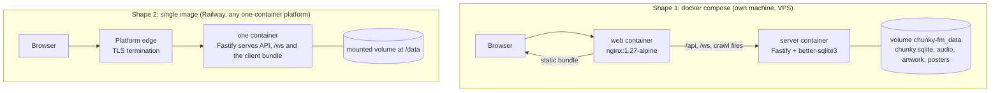
```mermaid
flowchart TB
    subgraph Compose["Shape 1: docker compose (own machine, VPS)"]
        direction LR
        BrowserA["Browser"] --> Nginx["web container<br/>nginx:1.27-alpine"]
        Nginx -- "static bundle" --> BrowserA
        Nginx -- "/api, /ws, crawl files" --> SrvA["server container<br/>Fastify + better-sqlite3"]
        SrvA --- VolA[("volume chunky-fm_data<br/>chunky.sqlite, audio, artwork, posters")]
    end

    subgraph Single["Shape 2: single image (Railway, any one-container platform)"]
        direction LR
        BrowserB["Browser"] --> Edge["Platform edge<br/>TLS termination"]
        Edge --> SrvB["one container<br/>Fastify serves API, /ws and the client bundle"]
        SrvB --- VolB[("mounted volume at /data")]
    end
```

| | Serves the client | `CLIENT_DIR` | Where it is used |
|---|---|---|---|
| `docker-compose.yml` | nginx, in its own container | unset | Local machine, VPS, anything with nothing in front |
| root `Dockerfile` | Fastify, same process as the API | `/app/client` | Railway, or any platform that runs one container behind its own edge |

There is no database container. The store is SQLite opened in-process through
`better-sqlite3`, so what would be a `db` service elsewhere is a volume here.
The SQLite file, the audio and the artwork only mean anything together: rows
name files on disk.

```bash
# Back the library up whole
docker run --rm -v chunky-fm_data:/data -v "$PWD:/out" busybox \
  tar czf /out/chunky-backup.tar.gz -C /data .
```

---

## The front door

Five documents are served, and the routing rules that decide which one answers
an address exist in **three** independent implementations:


```mermaid
flowchart TD
    Req["Incoming request"] --> Root{"Path"}

    Root -- "/ with ?k=" --> Fwd["302 to /listen?k=..."]
    Root -- "/ without a key" --> Landing["landing.html<br/>the page in front of the station"]
    Root -- "/listen, /admin" --> Station["index.html<br/>the station app"]
    Root -- "/cohost" --> CoHost["cohost.html<br/>the co-host surface"]
    Root -- "/how-it-works" --> How["how-it-works.html<br/>prose, no bundle"]
    Root -- "/podcast, /podcast/*" --> Pod["podcast.html<br/>the archive and the player"]
    Root -- "/welcome" --> R1["301 to /"]
    Root -- "/landing.html" --> R2["301 to /"]
    Root -- "/index.html" --> R3["301 to /listen"]
    Root -- "/cohost.html" --> R4["301 to /cohost"]
    Root -- "/how-it-works.html" --> R5["301 to /how-it-works"]
    Root -- "/podcast.html" --> R6["301 to /podcast"]
    Root -- "/api/*, /ws" --> Api["Fastify"]
    Root -- "robots.txt, sitemap.xml, llms.txt" --> Crawl["Fastify crawl routes"]
    Root -- "a real file in the bundle" --> Static["favicon, og.png, apple-touch-icon"]
    Root -- "anything else" --> NotFound["404 with 404.html"]
```

| Implementation | File | Environment it serves |
|---|---|---|
| nginx | `client/nginx.conf` | the compose stack |
| Vite middleware plugin | `client/vite.config.ts` | `npm run dev` and `vite preview` |
| Fastify hook | `server/src/lib/doorway.ts` | the single image, which is what Railway runs |

None of the three can import from the others: the client image does not contain
the server directory, and vice versa. They are kept honest by CI, which drives
the compose stack and the single image with the same set of assertions.

Three rules are worth calling out:

- **An invite must never reach the landing page.** A private station's link is
  `/?k=<key>`, and older invites still say exactly that. The landing document
  contains no code to redeem a key, so a request for `/` carrying one is
  forwarded to `/listen` with the key intact. The nginx test is `if ($arg_k != "")`
  rather than `if ($arg_k)`, because nginx's own notion of truth reads a key of
  literally `0` as absent.
- **`/podcast/` is the one prefix rule.** Every other address is matched
  exactly, because every other address is known. An episode's is not: the slug
  is part of the path and no front door has a list of them to check against. So
  the rule is `/podcast` exactly, plus anything under `/podcast/` — which stops
  at the separator, so `/podcastly` is still nothing, the same way `/welcomely`
  is not `/welcome`. Being the only prefix rule makes it the only one that can
  go missing while every other check still passes, so CI drives an episode
  address by name against both nginx and the single image.
- **Unknown addresses are a real 404.** An app-shell fallback (`try_files ... /index.html`)
  answers every typo with the station and a `200`, which is a soft 404: it
  advertises `/whatevr` as a real page and offers unlimited duplicates of the
  station to a crawler. Paths are named one by one instead. The one deliberate
  divergence is the Vite dev server, which still falls back, because enumerating
  every path a dev server invents for itself is a worse failure mode.

---

## Server architecture

Fastify, TypeScript, ESM. `buildApp` composes a set of small domain objects,
wires their events together, registers route plugins, and attaches the WebSocket
surface to the same HTTP server.

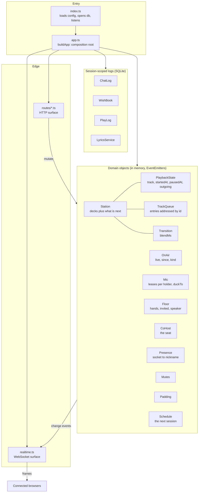
```mermaid
flowchart TB
    subgraph Entry
        Index["index.ts<br/>loads config, opens db, listens"]
        App["app.ts<br/>buildApp: composition root"]
    end

    subgraph Domain["Domain objects (in memory, EventEmitters)"]
        Station["Station<br/>decks plus what is next"]
        Playback["PlaybackState<br/>track, startedAt, pausedAt, outgoing"]
        Queue["TrackQueue<br/>entries addressed by id"]
        Transition["Transition<br/>blendMs"]
        OnAir["OnAir<br/>live, since, kind"]
        Mic["Mic<br/>leases per holder, duckTo"]
        Floor["Floor<br/>hands, invited, speaker"]
        CoHostO["CoHost<br/>the seat"]
        Presence["Presence<br/>socket to nickname"]
        Mutes["Mutes"]
        Padding["Padding"]
        Schedule["Schedule<br/>the next session"]
    end

    subgraph Persisted["Session-scoped logs (SQLite)"]
        Chat["ChatLog"]
        Wishes["WishBook"]
        Plays["PlayLog"]
        Lyrics["LyricsService"]
    end

    subgraph Edge["Edge"]
        Routes["routes/*.ts<br/>HTTP surface"]
        Realtime["realtime.ts<br/>WebSocket surface"]
    end

    Index --> App
    App --> Domain
    App --> Persisted
    App --> Routes
    App --> Realtime
    Station --- Playback
    Station --- Queue
    Station --- Transition
    Routes -- "mutate" --> Domain
    Domain -- "change events" --> Realtime
    Realtime -- "frames" --> Clients["Connected browsers"]
```

### Event wiring

The composition root is the only place that knows how domains relate. Domain
objects never reach for each other.

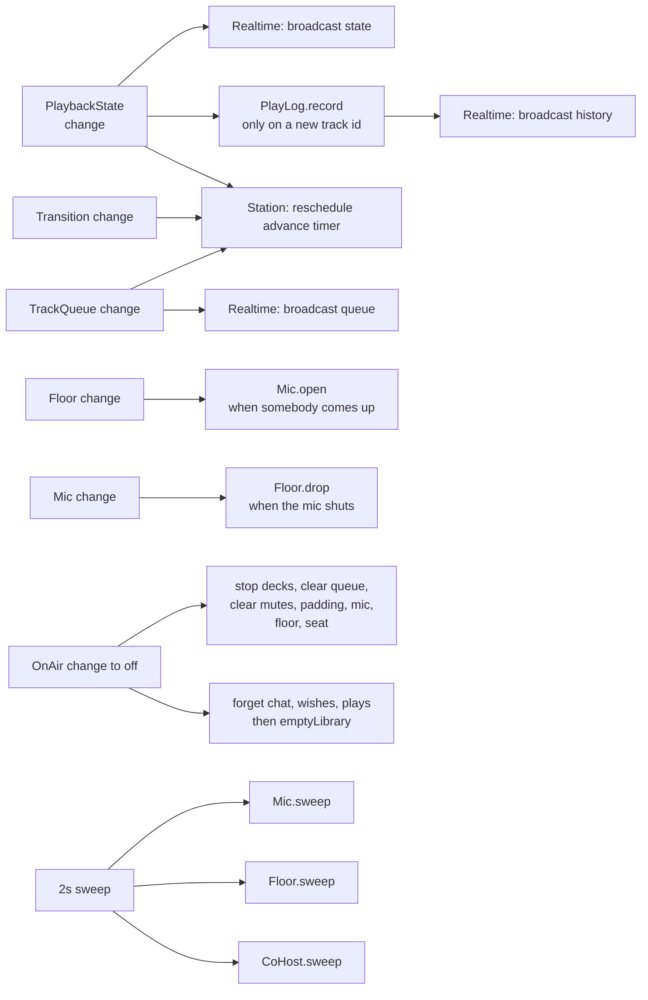
```mermaid
flowchart LR
    PB["PlaybackState<br/>change"] --> RS["Realtime: broadcast state"]
    PB --> PL["PlayLog.record<br/>only on a new track id"]
    PL --> RH["Realtime: broadcast history"]
    PB --> ST["Station: reschedule advance timer"]
    TR["Transition change"] --> ST
    QC["TrackQueue change"] --> ST
    QC --> RQ["Realtime: broadcast queue"]

    FL["Floor change"] --> MO["Mic.open<br/>when somebody comes up"]
    MC["Mic change"] --> FD["Floor.drop<br/>when the mic shuts"]

    AIR["OnAir change to off"] --> CL["stop decks, clear queue,<br/>clear mutes, padding, mic,<br/>floor, seat"]
    AIR --> WIPE["forget chat, wishes, plays<br/>then emptyLibrary"]

    SWEEP["2s sweep"] --> MS["Mic.sweep"]
    SWEEP --> FS["Floor.sweep"]
    SWEEP --> CS["CoHost.sweep"]
```

Three lease sweeps share one interval. Each is the same kind of housekeeping:
somebody claimed to be somewhere and has to keep saying so.

| Lease | Constant | Held by | Renewed |
|---|---|---|---|
| Open mic | `MIC_LEASE_MS` 10s | decks, co-host (independently) | every 3s while the talk key is held |
| Mic after the decks' socket drops | `MIC_HURRY_MS` 6s | decks | as above, over HTTP |
| Invitation to the floor | `INVITE_TTL_MS` 60s | an invited listener | not renewed; it expires |
| Co-host seat | `SEAT_LEASE_MS` 30s | the co-host's socket | by the co-host page |

The mic holds a lease **per holder** (`decks`, `cohost`) rather than a single
boolean, so a co-host finishing a sentence does not un-duck the room in the
middle of one the decks are still saying.

---

## Data model

Only four kinds of thing are written down. Everything else is true for as long
as a process or a socket is up, by design.

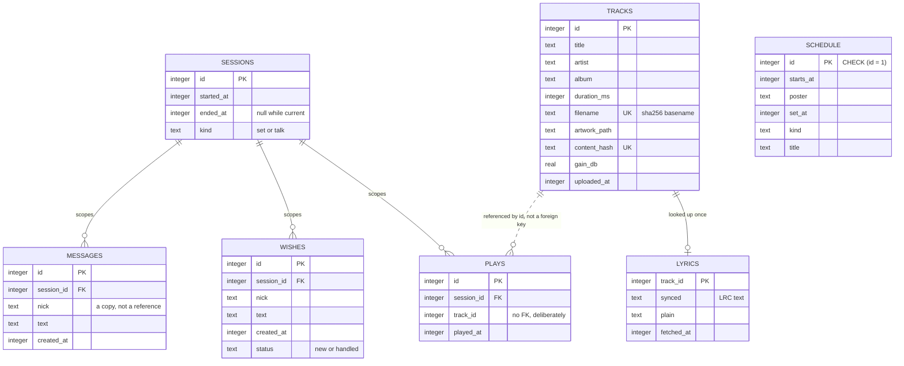
```mermaid
erDiagram
    SESSIONS ||--o{ MESSAGES : scopes
    SESSIONS ||--o{ WISHES : scopes
    SESSIONS ||--o{ PLAYS : scopes
    TRACKS ||--o| LYRICS : "looked up once"
    TRACKS ||..o{ PLAYS : "referenced by id, not a foreign key"

    SESSIONS {
        integer id PK
        integer started_at
        integer ended_at "null while current"
        text    kind "set or talk"
    }
    TRACKS {
        integer id PK
        text    title
        text    artist
        text    album
        integer duration_ms
        text    filename UK "sha256 basename"
        text    artwork_path
        text    content_hash UK
        real    gain_db
        integer uploaded_at
    }
    LYRICS {
        integer track_id PK
        text    synced "LRC text"
        text    plain
        integer fetched_at
    }
    MESSAGES {
        integer id PK
        integer session_id FK
        text    nick "a copy, not a reference"
        text    text
        integer created_at
    }
    WISHES {
        integer id PK
        integer session_id FK
        text    nick
        text    text
        integer created_at
        text    status "new or handled"
    }
    PLAYS {
        integer id PK
        integer session_id FK
        integer track_id "no FK, deliberately"
        integer played_at
    }
    SCHEDULE {
        integer id PK "CHECK (id = 1)"
        integer starts_at
        text    poster
        integer set_at
        text    kind
        text    title
    }
```

Points that a reviewer should not have to infer:

- **`plays.track_id` is deliberately not a foreign key.** The insert happens
  inside playback's `change` event, so a constraint able to refuse it would
  throw into whatever put the track on: an admin command answering 500 after the
  track already changed, or the end-of-track timer dying mid-set. A note about
  what happened must not be able to break the thing it is a note about. The read
  is an inner join, so an unresolvable play is omitted rather than rendered
  blank.
- **`messages.nick` is a copy; `plays.track_id` is a reference.** A person who
  renames themselves keeps the name they said something under. A track that gets
  retagged was mislabelled all along, so the history should read correctly.
- **`schedule` is one row, ever.** `CHECK (id = 1)` makes that a rule the
  database keeps rather than a convention the code remembers.
- **Schema changes are stated twice.** `CREATE TABLE IF NOT EXISTS` is a no-op
  against a table that already exists, so every added column appears in `SCHEMA`
  (what a fresh database is built from) and again in `ADDED_COLUMNS` (what an
  existing one is migrated with). Tests only exercise the first half, because
  they start from an empty file.

### Storage layout

Everything under `AUDIO_STORAGE_DIR`:

```
audio_storage/
  audio/     <sha256>.mp3    uploaded files, named by content hash
  artwork/   <sha256>.jpg    artwork extracted from tags at upload time
  posters/   <id>.<ext>      session posters, public
  episodes/
    audio/   <sha256>.mp3    podcast episodes, public
    posters/ <id>.<ext>      episode posters, public, always 1080x1350
  tmp/                       in-flight uploads, cleaned on completion
  chunky.sqlite
```

`episodes/` is deliberately not under `audio/`, and the separation is
load-bearing rather than tidy. Ending a broadcast deletes every row in `tracks`
and every file behind it (see [Session lifecycle](#session-lifecycle)): the
station is an evening, not a back catalogue. The archive is the one thing here
meant to survive that, so it shares no table and no directory with any of it,
and there is no path by which ending a session can reach it. See
[The podcast archive](#the-podcast-archive).

---

## Identity and authorisation

Three credentials guard three different things and go to three different sets of
people. The relation is a ladder, not three separate doors.

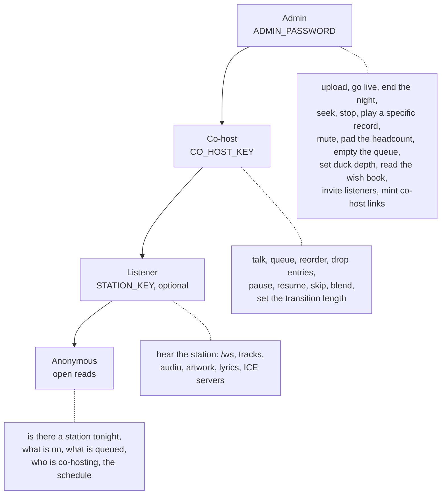
```mermaid
flowchart TB
    Admin["Admin<br/>ADMIN_PASSWORD"] --> CoHost["Co-host<br/>CO_HOST_KEY"]
    CoHost --> Listener["Listener<br/>STATION_KEY, optional"]
    Listener --> Public["Anonymous<br/>open reads"]

    Admin -.- A1["upload, go live, end the night,<br/>seek, stop, play a specific record,<br/>mute, pad the headcount, empty the queue,<br/>set duck depth, read the wish book,<br/>invite listeners, mint co-host links"]
    CoHost -.- C1["talk, queue, reorder, drop entries,<br/>pause, resume, skip, blend,<br/>set the transition length"]
    Listener -.- L1["hear the station: /ws, tracks,<br/>audio, artwork, lyrics, ICE servers"]
    Public -.- P1["is there a station tonight,<br/>what is on, what is queued,<br/>who is co-hosting, the schedule"]
```

### Key derivation

Every cookie is an HMAC under a distinct domain label. That matters more than it
looks: on an unconfigured station the admin password and the station key are the
**same string**, and the labels are the only reason a listener token does not
verify as an admin token.

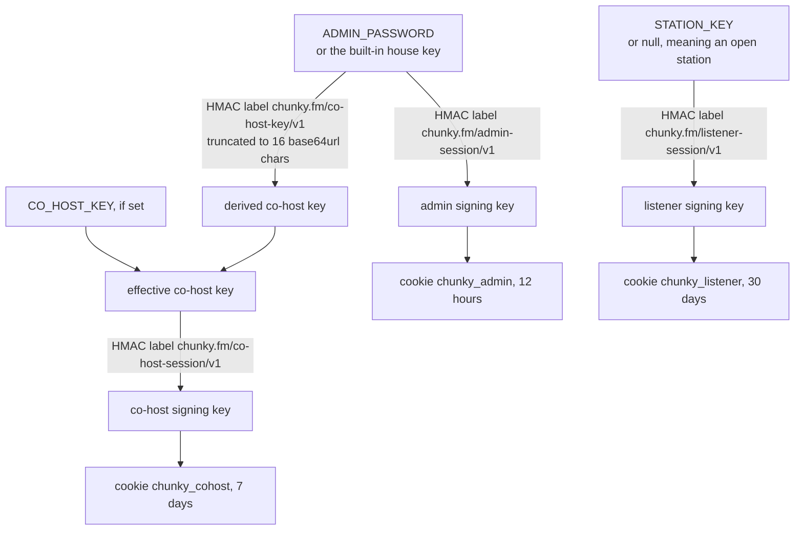
```mermaid
flowchart TB
    AP["ADMIN_PASSWORD<br/>or the built-in house key"]
    SK["STATION_KEY<br/>or null, meaning an open station"]
    CK["CO_HOST_KEY, if set"]

    AP -- "HMAC label chunky.fm/co-host-key/v1<br/>truncated to 16 base64url chars" --> DCK["derived co-host key"]
    CK --> EFF["effective co-host key"]
    DCK --> EFF

    AP -- "HMAC label chunky.fm/admin-session/v1" --> AK["admin signing key"]
    SK -- "HMAC label chunky.fm/listener-session/v1" --> LK["listener signing key"]
    EFF -- "HMAC label chunky.fm/co-host-session/v1" --> CKK["co-host signing key"]

    AK --> AC["cookie chunky_admin, 12 hours"]
    LK --> LC["cookie chunky_listener, 30 days"]
    CKK --> CC["cookie chunky_cohost, 7 days"]
```

There is no session store. A token is `<expiresAt>.<nonce>.<signature>`, with
the expiry inside the signed payload, so a client that ignores `Max-Age` still
finds it refused. Because signing keys are derived from the secrets themselves,
**rotating a secret invalidates every credential issued under it at once**,
which is the only revocation mechanism the system has and the only one a shared
key can support.

Cookies are `HttpOnly`, `SameSite=Strict`, and `Secure` whenever the request
arrived over TLS (following `X-Forwarded-Proto`, since Railway terminates TLS in
front of the app). The password itself is still accepted directly as
`Authorization: Bearer ...` or `x-admin-password` on every admin route: a
browser should not hold a shared secret for hours, but a curl one-liner has
nowhere else to put one.

### Sign-in

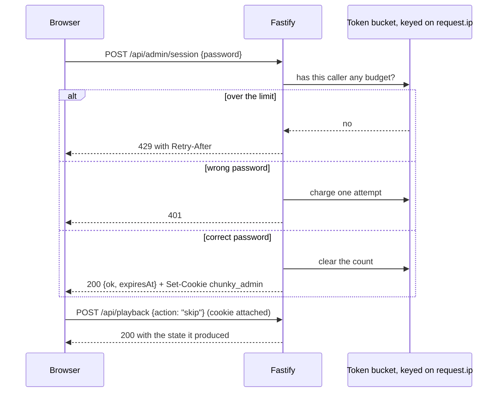
```mermaid
sequenceDiagram
    participant B as Browser
    participant F as Fastify
    participant T as Token bucket, keyed on request.ip

    B->>F: POST /api/admin/session {password}
    F->>T: has this caller any budget?
    alt over the limit
        T-->>F: no
        F-->>B: 429 with Retry-After
    else wrong password
        F->>T: charge one attempt
        F-->>B: 401
    else correct password
        F->>T: clear the count
        F-->>B: 200 {ok, expiresAt} + Set-Cookie chunky_admin
    end
    B->>F: POST /api/playback {action: "skip"}  (cookie attached)
    F-->>B: 200 with the state it produced
```

Only *wrong* attempts are charged and success clears the count, so an admin who
fumbles their own password twice is not locked out of their own station. The
password is the entire admin gate, so the rate at which a stranger can test
guesses is part of how strong it is.

| Endpoint | Burst | Refill | Keyed on |
|---|---|---|---|
| `POST /api/admin/session` | 5 | 1 per 60s | caller IP |
| `POST /api/listen` | 10 | 1 per 60s | caller IP |
| `POST /api/cohost/session` | 5 | 1 per 60s | caller IP |

`request.ip` is read through `trustProxy`, which defaults to true because both
supported deployments sit behind a proxy. One shared bucket for everyone behind
that proxy would not be brute-force protection; it would be a way for a stranger
to lock the admin out.

### Whether there is a door at all

`STATION_KEY` unset is an **open station**: anyone with the address can listen
and nobody is asked for anything. This default has been both ways round. The
argument for a door was that a station which quietly became public because a
variable went missing is a bad surprise. The argument against, which won, is
that the door was charged to every listener on every visit in order to protect a
room of friends listening to music together.

Setting `STATION_KEY` puts the door back on with the mechanism untouched:
invite links (`/listen?k=<key>`, and `/?k=<key>` forwarded), a typed code on the
refused screen, a signed cookie good for a month, and rotation as the way to
un-invite everybody at once. The key comes straight back out of the address bar
after redemption, because a secret left in a URL is a secret in the history, in
every screenshot and in the `Referer` of every outbound link.

`STATION_OPEN` is what taking the door off used to require. It is still accepted
and is now a no-op, so a compose file that has been carrying it keeps meaning
what it always meant.

---

## HTTP API

Every mutation is here. The gate column names the *minimum* credential; the
ladder means a stronger one always satisfies a weaker gate.

### Station and session

| Route | Gate | Description |
|---|---|---|
| `GET /health` | open | Liveness. Used by both Dockerfile healthchecks and by Railway. |
| `GET /api/session` | open | `{live, since, kind}`. Whether the station is broadcasting, since when, and what kind of night. |
| `POST /api/session` | admin | `{action: 'start'\|'end', kind?: 'set'\|'talk'}`. Both idempotent. |
| `GET /api/schedule` | open | `{schedule}`: the next announced session, or null. |
| `PUT /api/schedule` | admin | Multipart: `startsAt`, optional `kind`, `title`, and a poster file. Omitting the file keeps the existing poster. |
| `DELETE /api/schedule` | admin | Withdraws the announcement. |
| `GET /api/poster/*` | open | Static poster files, immutable, one year. |

### Playback and queue

| Route | Gate | Description |
|---|---|---|
| `GET /api/playback` | open | The playback snapshot. |
| `POST /api/playback` | co-host for `pause`, `resume`, `skip`, `blend`; **admin** for `play`, `seek`, `stop` | Body `{action, trackId?, positionMs?}`. Returns the state it produced, having already broadcast it. |
| `GET /api/queue` | open | `{entries}`. |
| `POST /api/queue` | co-host | `{trackId}` to the back of the queue. `201 {entry, entries}`. |
| `POST /api/queue/move` | co-host | `{entryId, toIndex}`, index clamped. |
| `DELETE /api/queue/:entryId` | co-host | Drops one entry. |
| `DELETE /api/queue` | **admin** | Empties the queue; leaves the current record playing. |
| `GET /api/transition` | open | `{blendMs}`. |
| `POST /api/transition` | co-host | Sets the crossfade length. |

The split inside `POST /api/playback` is not about danger. `pause`, `resume`,
`skip` and `blend` all act on the record already playing, which is the one the
co-host can see and has been talking over. `play`, `seek` and `stop` reach past
it, into the library or into the middle of a track, and belong to whoever can
see the whole set. The check is inside the handler rather than a second
preHandler because it depends on the body, and splitting the route would give
the verb list two places to drift apart in.

### Library and media

| Route | Gate | Description |
|---|---|---|
| `POST /api/upload` | admin | One audio file per request, `multipart/form-data`. |
| `GET /api/tracks` | listener | The library as JSON. |
| `GET /api/audio/:filename` | listener | Audio with `Range` support, `immutable`. |
| `GET /api/artwork/:filename` | listener | Artwork extracted at upload time. |
| `GET /api/lyrics/:trackId` | listener | Read-through to LRCLIB, memoised in SQLite. |

`Range` support is load-bearing rather than a nicety: a listener joining at 2:14
has to fetch that byte range before it can play, and without it the browser
pulls the file from 0:00 first. URLs are content hashes, which is what makes
`immutable` honest.

Upload statuses:

| Status | When |
|---|---|
| `201` | Stored. Body is `{track}`. |
| `400` | No file part, empty file, or a malformed multipart body. |
| `401` | Missing or refused admin credentials. |
| `409` | Already in the library. Body carries the existing `track`. |
| `413` | Over `MAX_UPLOAD_BYTES` (default 150 MiB). |
| `415` | Not audio, or a container the station does not serve. |

Supported containers: MP3, FLAC, Ogg/Opus, WAV, MP4/M4A, AIFF.

### The podcast archive

The one part of this API whose **reads are open on a private station**. See
[The podcast archive](#the-podcast-archive) for why.

| Route | Gate | Description |
|---|---|---|
| `GET /api/episodes` | open | Published episodes, newest first. |
| `GET /api/episodes/:slug` | open | One episode. A draft is `404` here, and visible to an admin. |
| `GET /api/episode-audio/:filename` | open | Audio with `Range` support, `immutable`. |
| `GET /api/episode-poster/:filename` | open | The poster, `immutable`. |
| `GET /api/admin/episodes` | admin | Everything, drafts included. The console's list. |
| `POST /api/episodes` | admin | `multipart/form-data`: an `audio` part, a `poster` part, and the fields. |
| `PATCH /api/episodes/:id` | admin | Partial. Absent means "leave it"; an explicit `null` clears. |
| `DELETE /api/episodes/:id` | admin | Row first, then both files. |

Upload statuses:

| Status | When |
|---|---|
| `201` | Stored. Body is `{episode}`. |
| `400` | No audio part, no poster part, an empty file, or no title. |
| `401` | Missing or refused admin credentials. |
| `409` | That audio is already an episode. Body carries the existing `episode`. |
| `413` | Audio over `MAX_UPLOAD_BYTES`, or a poster over 8 MiB. |
| `415` | Not audio, or a poster that is not a JPEG, PNG or WebP. |
| `422` | The poster is not 1080x1350. The message names the size received. |

### Voice and the room

| Route | Gate | Description |
|---|---|---|
| `GET /api/mic` | open | `{live, duckTo, since}`. |
| `POST /api/mic` | co-host for `open`, `renew`, `close`; **admin** for `duck` | Duck depth is a decision about how the station sounds, made by whoever can hear the room mix. |
| `GET /api/floor` | open | `{speaker, invited}`: who besides the decks is talking. |
| `POST /api/floor` | admin | `{action: 'invite'\|'drop'}`. |
| `GET /api/rtc` | listener | `{iceServers}`. Behind the listener gate because both ends of a voice need it. |
| `GET /api/wishes` | admin | `{wishes, outstanding}` for this session, oldest first. |
| `POST /api/wishes/:wishId` | admin | `{status: 'new'\|'handled'}`. Reversible; a handled wish stays in the book. |
| `GET /api/mutes` | admin | `{nicknames}`. |
| `POST /api/mutes` | admin | `{nickname, muted}`, stating where the nickname now stands rather than toggling. |
| `GET /api/padding` | admin | `{padding}`: heads added to the tally on top of the roster. |
| `POST /api/padding` | admin | `{padding}`, whole numbers 0 to 9999. |

`/api/mutes` and `/api/padding` are admin-only in **both** directions, unlike
`/api/session`. Publishing the mute list would turn a quiet word into a public
naming; publishing the padding split would tell the room how much of tonight's
crowd is nobody.

### Credentials and doors

| Route | Gate | Description |
|---|---|---|
| `POST /api/admin/session` | open, throttled | `{password}` to a signed cookie. |
| `GET /api/admin/session` | admin | `{ok: true}` while the session holds. Exists because every other admin route *does* something. |
| `DELETE /api/admin/session` | open | Signs out. Dropping a cookie you hold is not an attack. |
| `GET /api/listen` | open | `204` if this browser is admitted, `401` if not. |
| `POST /api/listen` | open, throttled | `{key}` to a listener cookie. |
| `GET /api/invite` | admin | `{key}`: the station key, or null on an open station. |
| `GET /api/cohost` | open | `{seat}`: who is co-hosting. |
| `GET /api/cohost/session` | open | `204` if this browser holds a seat. |
| `POST /api/cohost/session` | open, throttled | `{key}` to a co-host cookie. Only a **wrong** key is charged. |
| `DELETE /api/cohost/session` | open | Hands the key back. Deliberately does not stand anybody down. |
| `POST /api/cohost/seat` | co-host | `{action: 'take'\|'renew'\|'leave', socket, nickname}`. |
| `GET /api/cohost/key` | admin | The co-host key, so the console can build a link. |

`GET /api/invite` and `GET /api/cohost/key` are admin-only, and that is the
entire invitation policy: a listener's browser cannot rebuild an invite on its
own, because the cookie is `HttpOnly` and the key was removed from the address
bar on arrival. Being invited means somebody holding the password sent you a
link. A co-host who could read the key could quietly recruit a third.

### Crawl surface

`GET /robots.txt`, `GET /sitemap.xml` and `GET /llms.txt` are answered by
Fastify rather than served from the bundle, because a sitemap carries absolute
URLs and only the request reliably knows what address the station is being
reached on. nginx proxies them with `Host` forwarded, above the static fallback
that would otherwise answer a robots file with a page of HTML and a `200`.

---

## Realtime protocol

`GET /ws`. One socket per tab, opened when the page loads, which is before
anybody has typed a name.

### Admission

The socket is refused at the **handshake** with a `401` rather than being opened
and closed a moment later. A client cannot tell a closed socket from a station
that dropped, and would sit reconnecting into the refusal forever, telling the
listener the station is down when it is only shut to them.

Two further predicates are evaluated once, against the upgrade headers, and
never again: whether this connection is the decks, and whether it presented a
co-host key. A socket does not get to change its mind about who it is halfway
through an evening.

### The connect burst

Ordering is load-bearing, not incidental.

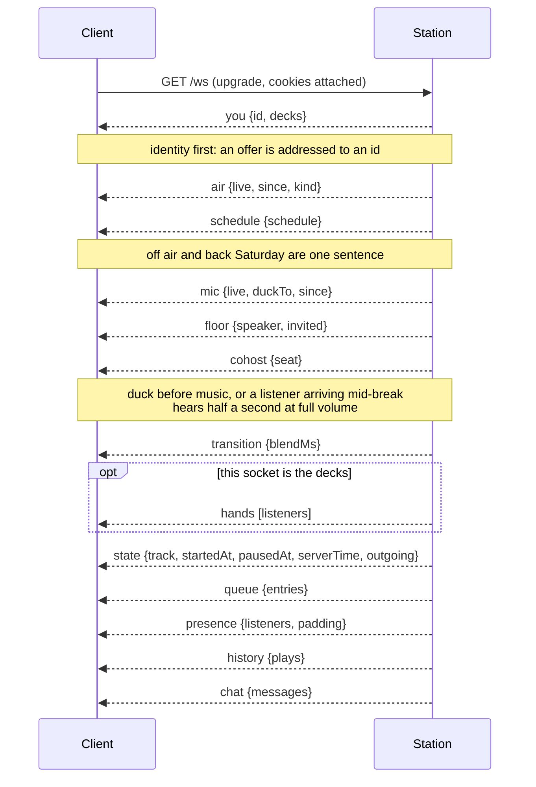
```mermaid
sequenceDiagram
    participant C as Client
    participant S as Station

    C->>S: GET /ws (upgrade, cookies attached)
    S-->>C: you {id, decks}
    Note over S,C: identity first: an offer is addressed to an id
    S-->>C: air {live, since, kind}
    S-->>C: schedule {schedule}
    Note over S,C: off air and back Saturday are one sentence
    S-->>C: mic {live, duckTo, since}
    S-->>C: floor {speaker, invited}
    S-->>C: cohost {seat}
    Note over S,C: duck before music, or a listener arriving mid-break<br/>hears half a second at full volume
    S-->>C: transition {blendMs}
    opt this socket is the decks
        S-->>C: hands [listeners]
    end
    S-->>C: state {track, startedAt, pausedAt, serverTime, outgoing}
    S-->>C: queue {entries}
    S-->>C: presence {listeners, padding}
    S-->>C: history {plays}
    S-->>C: chat {messages}
```

### Server to client

| Frame | Audience | When |
|---|---|---|
| `you` | one socket | First frame. Carries this socket's id and whether the station considers it the decks. |
| `air` | broadcast | Connect, and every change to whether the station is live. |
| `schedule` | broadcast | Connect, and whenever an admin changes the announcement. |
| `mic` | broadcast | Connect, and every mic change. |
| `floor` | broadcast | Connect, and whenever somebody is invited, comes up or is dropped. |
| `cohost` | broadcast | Connect, and whenever the seat changes. |
| `transition` | broadcast | Connect, and whenever the blend length moves. |
| `hands` | **decks only** | Connect (for a console), and whenever the list changes. |
| `state` | broadcast | Connect, and every playback change. |
| `queue` | broadcast | Connect, and every queue change. |
| `presence` | broadcast | Connect, and whenever the roster or the padding changes. |
| `chat` | broadcast | Connect (the tail), and one batch of one per new message. |
| `history` | broadcast | Connect (the evening so far), and one per track going on. |
| `wished` | **one socket** | To the socket that made a wish, and to nobody else. |
| `signal` | **one socket** | A relayed WebRTC payload, with `from` stamped by the server. |
| `pong` | one socket | In reply to a clock probe. |
| `error` | one socket | Anything the socket refused. The connection stays open. |

The queue, the roster and the mic are separate frames rather than fields on
`state` because they change on entirely different schedules. Playback changes
several times a track; a mic break changes twice a sentence; the roster turns
over on its own. Folding them together would ship a full playback snapshot every
time whoever runs the decks drew breath.

`chat` and `history` are always batches, and their members carry ids. A client
that merges on id gets two properties for free: a reconnect replays history
without duplicating a line, and whatever happened while it was away arrives in
that replay instead of being a hole.

### Client to server

| Frame | Purpose |
|---|---|
| `ping {t0}` | Clock offset probe. |
| `join {nickname}` | "Here is what to call me." |
| `say {text}` | "Say this to the room." |
| `wish {text}` | "I would love to hear this." Goes to the admin, not the room. |
| `hand {action}` | `raise`, `lower` or `accept`: asking for the mic, and the two answers to being taken up on it. |
| `signal {to, payload}` | Relayed WebRTC negotiation. |

**Authorship is always the server's answer.** A `say`, `wish` or `hand` frame
carries no author; the name written down is the nickname the sending socket is
listed under on the roster. A frame that could name its own sender could sign
someone else's name to a message. This also makes the roster the gate: a socket
that has not joined has nothing to sign with and is told to name itself rather
than being quietly ignored.

**Commands go over HTTP.** Frames that look like commands (`play`, `skip`,
`enqueue`, `mic`, `go_live`, `mute`, `floor`, and others) are refused **by name**
with `command_over_http`, so a client that tries is told where the controls are
rather than left guessing. There is no privileged frame to authenticate here,
because every mutation lives behind a gate on an HTTP route. A socket that
cannot mutate anything is a socket that cannot be abused into mutating something.

Signalling is the one place that rule bends, and it bends narrowly: an offer
mutates nothing, plays nothing and is not read by the process. What it *is* is
addressed, and an address book has to know which connection is which.

### Refusal codes

`code` is machine-readable, `message` is prose, and `about` names the frame a
refusal was for, so a page with two composers and a hand button can put "not
sent" under the right one.

```
unrecognised_message  nickname_required  message_too_long  empty_message
command_over_http     not_joined         no_chat           wish_too_long
empty_wish            no_wishes          no_floor          not_invited
slow_down             off_air            muted             not_the_decks
no_such_peer          may_not_offer
```

`about` is one of `join`, `say`, `wish`, `signal`, `hand`, and is absent only
when the frame was too malformed to say what it was trying to do.

### Pacing

Every repeatable frame has its own token bucket, per socket rather than per
listener, so one listener talking never spends another's and nothing has to be
cleaned up after a socket that never comes back.

| Frame | Burst | Refill | Note |
|---|---|---|---|
| `say` | 5 | 1 per 2s | Chat is the first thing a listener can send that the server writes down. |
| `join` | 5 | 1 per 5s | Only a *roster-changing* join is charged, which keeps a reconnect's rejoin free. |
| `wish` | 3 | 1 per 30s | Tighter than chat: every wish is a row somebody has to read. |
| `hand` | 5 | 1 per 3s | Including `lower`, or raise-and-lower in a loop stays open as a way to make the console's list flicker. |
| `signal` | 40 | 1 per 500ms | The decks are exempt: fanning a voice out to a full room is one offer plus a dribble of candidates per listener, all at once. |

Refusals are answered with `slow_down`, not a dropped connection. Being refused
never also costs a token, and being muted costs none either, so being unmuted
does not leave you throttled.

### Liveness and shutdown

- **Heartbeat.** Every 30s the server pings each socket and terminates any that
  did not answer the previous round. A listener whose network vanished lingers
  for at most one interval.
- **Payload ceiling.** 16 KiB. It was 4 KiB, and an SDP description does not
  fit; `ws` answers an oversized frame by closing the socket, so the failure
  presented as the station dropping at exactly the moment somebody tried to
  speak.
- **Drain.** Shutdown sets a `draining` flag (which suppresses roster broadcasts
  as the room empties), closes every socket politely, then forces after a grace
  period. It runs on Fastify's `preClose` rather than `onClose`: an upgraded
  socket keeps the HTTP server open, so using `onClose` deadlocks shutdown for
  as long as anyone is listening.

---

## Playback, scheduling and transitions

### Advancing

When a record ends the server moves to the next one on its own, so a station
left alone keeps playing.

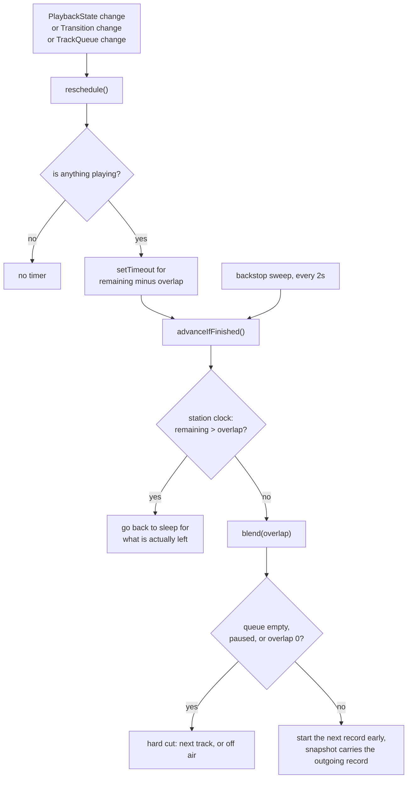
```mermaid
flowchart TB
    Change["PlaybackState change<br/>or Transition change<br/>or TrackQueue change"] --> Resched["reschedule()"]
    Resched --> Rem{"is anything playing?"}
    Rem -- no --> Idle["no timer"]
    Rem -- yes --> Timer["setTimeout for<br/>remaining minus overlap"]
    Timer --> Check["advanceIfFinished()"]
    Backstop["backstop sweep, every 2s"] --> Check
    Check --> Clock{"station clock:<br/>remaining > overlap?"}
    Clock -- yes --> Sleep["go back to sleep for<br/>what is actually left"]
    Clock -- no --> Blend["blend(overlap)"]
    Blend --> Fallback{"queue empty,<br/>paused, or overlap 0?"}
    Fallback -- yes --> Advance["hard cut: next track, or off air"]
    Fallback -- no --> Cross["start the next record early,<br/>snapshot carries the outgoing record"]
```

The `setTimeout` is the mechanism; the 2s sweep is the safety net. A timer fires
late under load, and if the event loop stalls long enough it may as well not
have fired at all, where the failure mode is dead air until somebody notices.
The **station clock**, not the timer, decides whether a record is over: a timer
that fires early goes back to sleep for what is actually left. Overrun is never
carried over; the next track always starts at 0:00.

Rescheduling hangs off events rather than off `Station`'s own methods, so a
caller that reaches for `station.playback` directly still gets a correctly
re-armed advance. The queue is a trigger too, because the overlap is sized
against the *next* record as well as the current one.

### Crossfades

The station still does not mix. A crossfade cannot be a fader on the server any
more than the duck could be, because no audio passes through it. What happens
instead:

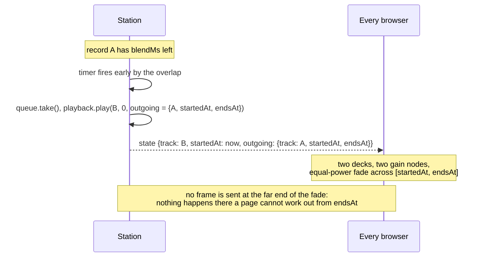
```mermaid
sequenceDiagram
    participant S as Station
    participant W as Every browser

    Note over S: record A has blendMs left
    S->>S: timer fires early by the overlap
    S->>S: queue.take(), playback.play(B, 0, outgoing = {A, startedAt, endsAt})
    S-->>W: state {track: B, startedAt: now, outgoing: {track: A, startedAt, endsAt}}
    Note over W: two decks, two gain nodes,<br/>equal-power fade across [startedAt, endsAt]
    Note over S,W: no frame is sent at the far end of the fade:<br/>nothing happens there a page cannot work out from endsAt
```

- `state.track` is unchanged in meaning: it is what is on, and during an overlap
  that is the incoming record from the instant it starts. The play log, the
  lyrics, the media session and the now-playing line all read `track`, and every
  one of them wants the new record the moment the blend begins.
- `outgoing` is additive and ignorable. A client that has never heard of it
  plays the incoming record on the clock and cuts.
- The window is two absolute instants rather than a length, so a listener who
  joins *during* a crossfade can work out where in it they have landed.
- The overlap is clamped to half the shorter of the two records, so a
  five-second interlude cannot swallow a twelve-second blend. `MAX_BLEND_MS` is
  12s and the default is 3s.

Two verbs reach the next record, deliberately not one with a flag:

| Action | Behaviour |
|---|---|
| `skip` | A hard cut. Somebody reaching for skip has decided the record is over; folding four seconds of it into the next one is the opposite of what they asked for. |
| `blend` | The transition, taken by hand. The outgoing record is cut where the fade ends rather than left running underneath for another minute. |

`blend` falls back to a cut on its own whenever there is nothing to fade, so
nothing has to ask first.

---

## Clock synchronisation and drift

Two separate problems, solved separately.

### The browser's clock is wrong

Every decision is made against `startedAt`, a server timestamp, so the client
first measures how far its own clock sits from the server's.

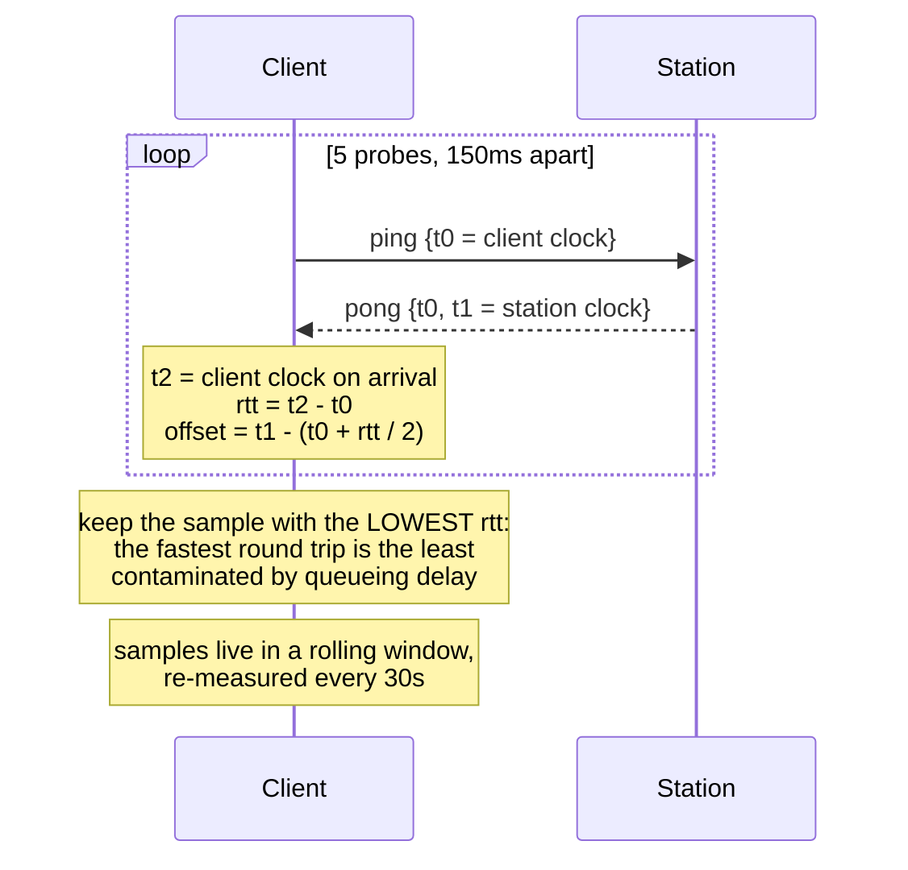
```mermaid
sequenceDiagram
    participant C as Client
    participant S as Station

    loop 5 probes, 150ms apart
        C->>S: ping {t0 = client clock}
        S-->>C: pong {t0, t1 = station clock}
        Note over C: t2 = client clock on arrival<br/>rtt = t2 - t0<br/>offset = t1 - (t0 + rtt / 2)
    end
    Note over C: keep the sample with the LOWEST rtt:<br/>the fastest round trip is the least<br/>contaminated by queueing delay
    Note over C: samples live in a rolling window,<br/>re-measured every 30s
```

Probes are spaced rather than fired in one burst, because five packets sent at
once share a queueing delay, which is exactly the contamination that taking the
lowest RTT is meant to avoid. `t1` and `startedAt` are stamped from the same
clock, so the measured offset applies directly.

### Audio clocks drift from system clocks

Being aligned once is not staying aligned. Every 2s:

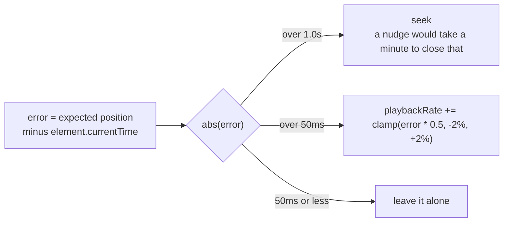
```mermaid
flowchart LR
    E["error = expected position<br/>minus element.currentTime"] --> D{"abs(error)"}
    D -- "over 1.0s" --> Seek["seek<br/>a nudge would take a minute to close that"]
    D -- "over 50ms" --> Rate["playbackRate += clamp(error * 0.5, -2%, +2%)"]
    D -- "50ms or less" --> Leave["leave it alone"]
```

Correcting with rate rather than seeking is the whole trick: a seek is an
audible glitch, a 2% rate change is not. `preservesPitch` defaults to true, so
the rate change time-stretches instead of pitch-shifting.

One note on the constants, which come from PLAN.md. The smallest error that
escapes the 50ms dead zone already exceeds the 2% cap once multiplied by the 0.5
gain, so the clamp always binds and correction is effectively bang-bang. That
converges from the worst non-seeking case in under a minute and is inaudible, so
it is left as specified. The proportional term only starts doing anything if the
dead zone drops below 40ms.

---

## Client architecture

React plus Vite. Four documents, three bundles.

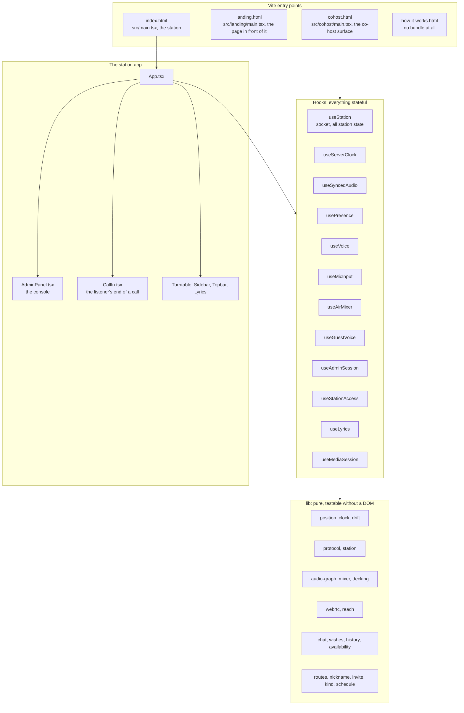
```mermaid
flowchart TB
    subgraph Bundles["Vite entry points"]
        I["index.html<br/>src/main.tsx, the station"]
        L["landing.html<br/>src/landing/main.tsx, the page in front of it"]
        CH["cohost.html<br/>src/cohost/main.tsx, the co-host surface"]
        H["how-it-works.html<br/>no bundle at all"]
    end

    subgraph StationApp["The station app"]
        App["App.tsx"]
        Admin["AdminPanel.tsx<br/>the console"]
        Call["CallIn.tsx<br/>the listener's end of a call"]
        Views["Turntable, Sidebar, Topbar, Lyrics"]
    end

    subgraph Hooks["Hooks: everything stateful"]
        US["useStation<br/>socket, all station state"]
        USC["useServerClock"]
        USA["useSyncedAudio"]
        UP["usePresence"]
        UV["useVoice"]
        UMI["useMicInput"]
        UAM["useAirMixer"]
        UGV["useGuestVoice"]
        UAS["useAdminSession"]
        USTA["useStationAccess"]
        UL["useLyrics"]
        UMS["useMediaSession"]
    end

    subgraph Lib["lib: pure, testable without a DOM"]
        Pos["position, clock, drift"]
        Prot["protocol, station"]
        Graph["audio-graph, mixer, decking"]
        Rtc["webrtc, reach"]
        Soc["chat, wishes, history, availability"]
        Rt["routes, nickname, invite, kind, schedule"]
    end

    I --> App
    App --> Views
    App --> Admin
    App --> Call
    App --> Hooks
    Hooks --> Lib
    CH --> Hooks
```

### Views

The station is one document; the address bar's fragment decides what is on
screen. A fragment rather than a path, because the station is served as a static
bundle and a real path would need every server in front of it to know every
route.

| Fragment | Route | Content |
|---|---|---|
| (empty) | `on-air` | The deck and everything around it. Where a listener lands. |
| `#sync` | `sync` | The clock numbers in full, with trails. |
| `#chat` | `chat` | The room, talking. |
| `#lyrics` | `lyrics` | The words to what is on, given the whole screen. |
| `#wishes` | `wishes` | What this listener has asked for. |
| `#history` | `history` | The evening so far. |
| `#admin` | `admin` | The console. The other mode, not another view. |

`STATION_PATH` is `/listen` and `CO_HOST_PATH` is `/cohost`. Nothing inside the
app depends on either, since every link the rail and the top bar draw is a bare
fragment that works at whatever path the document came from. What depends on
them is everything outside: the landing page's ways in, the invite link the
console builds, and the QA scripts.

### State ownership

| State | Owner | Lifetime |
|---|---|---|
| Playback, queue, air, mic, floor, seat, transition, roster, chat, history, schedule | `useStation`, fed entirely by socket frames | the socket, plus merge-by-id across reconnects |
| Clock offset and RTT | `useServerClock` | the page |
| Nickname | `localStorage` under `chunky.fm:nickname` | the browser |
| Admin session | the `HttpOnly` cookie; the page keeps **no** secret | 12 hours |
| Wishes this listener made | `useStation`, from `wished` frames | the page |
| Hand state: raised, invited, speaking | the server, via `floor` frames | the socket |

Nothing in the listener page is rendered optimistically. What was typed goes
out, and appears when it comes back with the id and timestamp the server gave
it. That costs a round trip on a station where everyone is already connected,
and buys a list that is the same list for everyone in the room rather than a
local-only line that a refused message would leave sitting there looking sent.

The console keeps no playback or queue state of its own either. Both arrive on
the socket the listener already has open, so a track ending by itself, or a
command issued from another tab, moves the console too. A command's own response
carries the state it produced, which the console folds in immediately rather
than sitting unchanged for a round trip.

### Availability

`StationStatus` (connecting, open, closed) is the wrong grain for a screen: a
page loaded against a dead server cycles `connecting -> offline -> connecting`
forever as the backoff runs, so anything keyed on the raw status alternates
between two messages once per retry while the truth never changes. Availability
is therefore a **fold** over statuses, not a mapping of them.

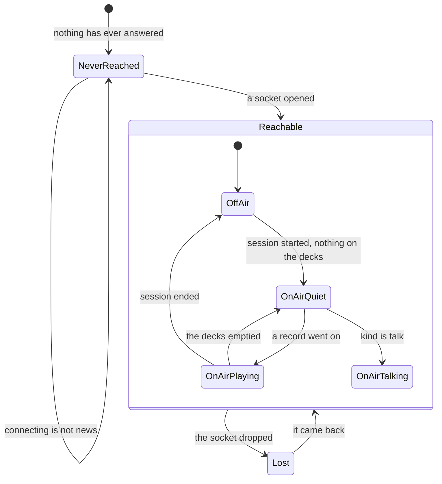
```mermaid
stateDiagram-v2
    [*] --> NeverReached: nothing has ever answered
    NeverReached --> Reachable: a socket opened
    Reachable --> Lost: the socket dropped
    Lost --> Reachable: it came back
    NeverReached --> NeverReached: connecting is not news

    state Reachable {
        [*] --> OffAir
        OffAir --> OnAirQuiet: session started, nothing on the decks
        OnAirQuiet --> OnAirPlaying: a record went on
        OnAirPlaying --> OnAirQuiet: the decks emptied
        OnAirQuiet --> OnAirTalking: kind is talk
        OnAirPlaying --> OffAir: session ended
    }
```

Five states, because they call for five different things being said:

- **Cannot find the station.** Nothing has ever answered. No Tune in button at all.
- **Had it and lost it.** Whatever the station last said stays on screen, with a
  line above it saying it is from before the drop. The track is deliberately not
  blanked: a short outage is the common one and the audio usually plays through
  it out of the buffer.
- **Off air.** The station answers perfectly well and nobody is broadcasting. No
  Tune in button: the click would be spent on silence.
- **On air, quiet.** A gap between records. The page says both halves.
- **On air, talking.** Same empty deck, opposite meaning. `air.kind` is why this
  is distinguishable at all, which is why kind travels on the air frame rather
  than being inferred from a playback snapshot.

Connectivity wins when the two disagree: a page that cannot reach the station
does not know whether anyone is on air, and the last thing it heard has stopped
being evidence of anything.

There is deliberately no Retry button. The connection is already retrying on a
backoff, and the only thing a button could do is what is happening anyway, while
implying the page had given up and was waiting to be asked.

### Joining

The nickname and the tune-in are the **same gesture**, and that is not a
simplification. Browsers only start audio from inside a user gesture, so the
form's submit handler is where `play()` has to be called; a nickname step before
a separate Tune in button would leave the audio starting outside any gesture at
all. A returning listener finds the field filled and still has to press the
button, because a name in `localStorage` is not a gesture.

Tuning in is refused while the station is unreachable for the same reason: a
listener who spends their click on an absent station gets a page that says a
track is on and no sound when it comes back, because `play()` would be called
from a broadcast handler rather than a click, and refused.

### The public pages

`/` is a second document with no socket, no clock and no audio element in its
bundle, which is the point: it has to describe the station on the days the
station is not up. Everything on it is invented, and it may not *look* like a
report, so the sample player carries the words "sample session" next to the
badge and every borrowed instrument sits inside an `aria-hidden` block.

Design is shared rather than copied, which is what stops the page in front of
the product drifting a shade off the product:

| File | Owns |
|---|---|
| `src/tokens.css` | Every colour, radius and face. Imported by both stylesheets and owned by neither. |
| `src/shared.css` | Objects both pages draw: the turntable, the LIVE badge, the level meter, the wordmark. |
| `src/styles.css` | The station: shell, rail, panels, console. |
| `src/landing/landing.css` | Arrangement only. It specifies no colour, radius or face of its own. |

The interactive sections are ports of [Aceternity UI](https://ui.aceternity.com)
components, adapted rather than vendored (this is not a shadcn project and has
no Tailwind, so utility classes become rules drawn from `tokens.css`):

| Component | Source | Notable departure |
|---|---|---|
| `ResizableNavbar` | Resizable Navbar | The lift arrives on `opacity` rather than by interpolating `box-shadow`, which is not composited and shimmers a 1px inset ring. The width cap belongs on the wrapper, not the bar. |
| `StickyScroll` + `CardStack` | Sticky Scroll Reveal, Card Stack | Progress is read as `scrollTop / (scrollHeight - clientHeight)`, which is the fraction the `index / count` breakpoints are actually expressed in. |
| `GlareCard` in `InfiniteMovingCards` | Glare Card, Infinite Moving Cards | The second lap is rendered, not `cloneNode`d, because a cloned node has no React on it. Pauses on focus and touch, not only hover. |
| `MacbookScroll` | Container Scroll Animation | Progress comes from `getBoundingClientRect` on a rAF-throttled listener, because the page's height changes without a resize event. |
| `DraggableCard` | Draggable Card | Drag is enabled only for `(hover: hover) and (pointer: fine)`, so a pile does not swallow a thumb's scroll. |
| `TiltCard` (the archive) | 3D Card Effect | Rotation divided by 60 rather than 25: this is a grid of cards, not one hero, and a page where every card is visibly askew will not sit still. Handlers are `onPointer*` and ignore anything that is not a mouse, because `onMouseMove` fires once on a tap and leaves a phone's card stuck at whatever angle the finger landed at. |
| `SquigglyText` | Squiggly Text | Driven by an interval at the step duration rather than a per-frame callback, stopped off screen, and disabled under `prefers-reduced-motion`. |
| `World` (globe) | GitHub Globe | Monochrome, twelve arcs all landing on one point, no `drei`, and the camera aspect is described to the `Canvas` rather than hardcoded. |

Both three.js scenes stop drawing when off screen (`useOnScreen`; the globe uses
`frameloop="never"`). Measured idle cost at 1440x900 under a software renderer,
where absolute numbers are pessimistic but ratios hold:

| Position | Drawing | Frame |
|---|---|---|
| top of the page | both | 217ms |
| past the hero | globe only | 100ms |
| bottom of the page | neither | 16.7ms |

`/how-it-works` is the only document with no bundle behind it: prose, an inline
stylesheet and a `FAQPage` schema. It describes the clock offset and the
playback-rate correction, because that is the question this project actually
gets asked, and a page whose whole job is to be read has no business waiting on
a globe to say its first sentence. Its numbers are read off `lib/clock.ts` and
`lib/drift.ts`; if those change, it is wrong until it changes too.

---

## Audio pipeline

### The listener

Five gain nodes, and no two of them are the same control.

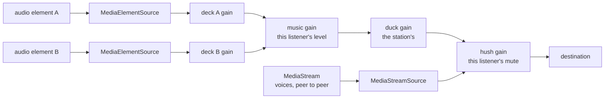
```mermaid
flowchart LR
    AE["audio element A"] --> SA["MediaElementSource"] --> DA["deck A gain"]
    BE["audio element B"] --> SB["MediaElementSource"] --> DB["deck B gain"]
    DA --> M["music gain<br/>this listener's level"]
    DB --> M
    DUCK["duck gain<br/>the station's"] --> HUSH
    M --> DUCK
    MS["MediaStream<br/>voices, peer to peer"] --> SV["MediaStreamSource"] --> HUSH["hush gain<br/>this listener's mute"]
    HUSH --> OUT["destination"]
```

| Gain | Belongs to | Covers |
|---|---|---|
| deck A, deck B | the transition | one record each; the crossfade is the pair moving in opposite directions |
| duck | the station | the music alone, so a voice is audible over a record |
| music | the listener | the music alone, under whatever else they are hearing |
| hush | the listener | everything, voices included: the mute button |

Folding any two together breaks something specific. Duck into music, and the
next mic break overwrites a level somebody set. Music into hush, and turning the
record down turns down the person you are answering. Duck into hush, and a mic
break becomes something a listener cannot turn off.

Implementation notes that cost real time to rediscover:

- **The decks alternate.** The outgoing record stays on the deck it was already
  playing on, untouched, and the incoming one goes onto the other. The obvious
  arrangement (element one is always what is on) would ask element two to load,
  seek and start a record element one has been playing perfectly for four
  minutes, at exactly the moment nothing is allowed to stutter. `lib/decking.ts`
  is the bookkeeping that follows.
- **The crossfade is equal power, drawn as eight linear ramps.** Two
  uncorrelated signals at half amplitude sum to about 0.7 of one at full, so a
  linear fade leaves an audible dip in the middle of every transition.
  `setValueCurveAtTime` is the obvious tool and the wrong one: it cannot be
  cancelled cleanly mid-flight in every browser, and it throws outright if a
  second one overlaps, which is exactly what happens when a listener's clock
  estimate improves halfway through a fade.
- **The duck is a `setTargetAtTime` ramp, about 250ms to settle.** An
  instantaneous gain change is an audible click, and a click reads as a fault
  rather than as a decision. Deck faders use linear ramps instead, which keeps
  the two kinds of automation distinguishable to an instrument outside the graph
  (this is how `qa:mic` measures a duck without also measuring every transition
  of the evening).
- **The graph is built lazily, inside the join click.** Routing an element
  through Web Audio is permanent and total, and a context that has never been
  resumed is not quiet music but *no* music, so the graph is only made at the
  moment there is a gesture to spend on waking it.
- **A remote stream connected only to Web Audio is silent in Chrome.** The
  stream is also parked on a hidden muted `<audio>` element, which is what starts
  the decoder. The audible path is still the graph, because a listener who joined
  at nine has no gesture left to spend on a `play()` at twenty to ten.

### The console

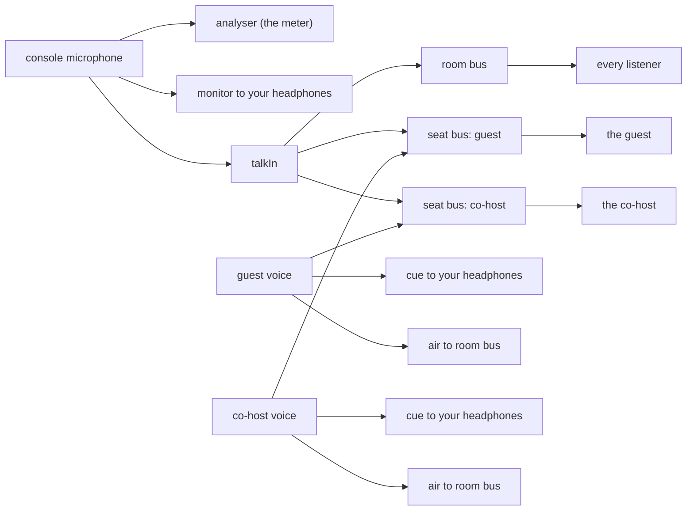
```mermaid
flowchart LR
    MIC["console microphone"] --> AN["analyser (the meter)"]
    MIC --> MON["monitor to your headphones"]
    MIC --> TI["talkIn"]
    TI --> ROOM["room bus"]
    TI --> SBG["seat bus: guest"]
    TI --> SBC["seat bus: co-host"]

    G["guest voice"] --> CUEG["cue to your headphones"]
    G --> AIRG["air to room bus"]
    G --> SBC

    C["co-host voice"] --> CUEC["cue to your headphones"]
    C --> AIRC["air to room bus"]
    C --> SBG

    ROOM --> LIS["every listener"]
    SBG --> GST["the guest"]
    SBC --> CHT["the co-host"]
```

The most important thing about this graph is a line that is **not** in it: there
is no path from a voice to its own seat bus. That absence is mix-minus, and it
is what makes a call possible. Send somebody the room bus and they hear
themselves about six hundred milliseconds later, which is not cosmetic: delayed
auditory feedback at that interval is used deliberately to disrupt fluency, and
the person it happens to will stop mid-sentence and assume the station is broken.

A bus **per voice** rather than one shared minus-bus, because with a co-host
there can be two people up, and one shared bus would mean the co-host and the
caller each hear the decks and neither hears the other.

The sound check is a deliberate milestone rather than a nicety: "the browser
will not give me the microphone" and "the connection will not establish" are
separate problems, and the first can be answered on one machine before any
peer-connection code exists to be blamed. Three controls, each doing more than
it looks like:

| Control | What it really is |
|---|---|
| Input | `enumerateDevices` filtered to `audioinput`, rebuilt on `devicechange`. Labels are empty until permission has been granted once. |
| "I'm on speakers" | An echo-cancellation switch in plain English. Cancellation is tuned for speech and treats anything sustained and musical as echo, so it comes **off** on headphones and the voice is noticeably better. |
| "Hear myself" | *Refused* on speakers rather than warned about. A monitor feeding the speaker its own microphone is a loop with nothing between its ends. |

The meter is fast up and slow down (speech is mostly gaps), scaled in dBFS over
a 60 dB window so a healthy speaking level sits in the middle of the bar, with
the clip lamp read off raw samples rather than the average because clipping is a
peak event an RMS never shows. Nothing in that loop touches React: the bar's
`transform` is written straight to the node from the animation frame.

---

## Voice: mic, call-in and co-host

### Ducking without audio

The mic route carries no sound and never will. The station broadcasts "the mic
is open, the music should sit this far down", and thirty browsers turn down the
copy they are each already playing, on the clock they already share.

That makes the ducking better than a mixed stream's rather than a compromise: it
lands everywhere at the same instant, it costs the server nothing, and it works
for a listener whose voice connection has failed or does not exist yet. It also
means the whole experience of a mic break is testable without a microphone.

`duckTo` is a linear gain clamped to `[0.05, 1]`, defaulting to `0.2` (about
-14 dB). The floor is deliberately not silence: a duck to nothing is a pause,
and a listener who cannot hear the bed has no way to tell a mic break from the
station having died.

`renew` is deliberately not `open`. Without the lease, a tab that died
mid-sentence would leave every listener sitting through a permanently quiet
song. Without the *separate verb*, a keep-alive still in flight when the key
came up would reopen the mic behind whoever had just stopped talking.

### Signalling

The voice is WebRTC, peer to peer, and it does not touch the server. One
`RTCPeerConnection` per listener, Opus mono capped at 32 kbps, so a room of
thirty is about a megabit off the console's uplink and nothing at all off the
station's.

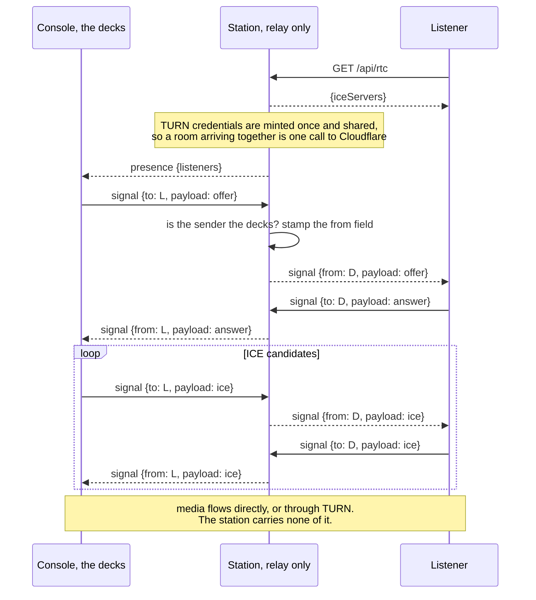
```mermaid
sequenceDiagram
    participant D as Console, the decks
    participant S as Station, relay only
    participant L as Listener

    L->>S: GET /api/rtc
    S-->>L: {iceServers}
    Note over S: TURN credentials are minted once and shared,<br/>so a room arriving together is one call to Cloudflare
    S-->>D: presence {listeners}
    D->>S: signal {to: L, payload: offer}
    S->>S: is the sender the decks? stamp the from field
    S-->>L: signal {from: D, payload: offer}
    L->>S: signal {to: D, payload: answer}
    S-->>D: signal {from: L, payload: answer}
    loop ICE candidates
        D->>S: signal {to: L, payload: ice}
        S-->>L: signal {from: D, payload: ice}
        L->>S: signal {to: D, payload: ice}
        S-->>D: signal {from: L, payload: ice}
    end
    Note over D,L: media flows directly, or through TURN.<br/>The station carries none of it.
```

The server owns the address book and nothing else. `payload` is opaque: a
station that validated SDP would be a station with an opinion about WebRTC
versions it has no way to keep current. What it *does* decide:

- The decks may address any socket. That is what fanning a voice out is.
- A listener may address the decks and nobody else. Two listeners have no
  business negotiating, and a socket that could reach any other by id would be a
  way to make the station introduce strangers.
- **`from` is stamped by the server, never carried by the sender.** Without it a
  listener could pose as the decks and offer somebody a microphone.
- A listener may not `offer`. The decks always offer, including for a guest's
  microphone, which travels on a connection the decks offered `recvonly` and the
  guest answered. That keeps the negotiation the simplest one WebRTC allows,
  since two peers can only collide if both of them can start.

Two operational facts worth stating plainly:

- **`YouMessage.decks` exists because of a bug that reached a deployed station.**
  A socket presents its credentials once, on the upgrade, and the console opens
  its socket when the page loads, which is before anybody has typed a password.
  Signing in afterwards leaves a connection the station does not recognise as
  the decks, on a page where everything else works perfectly, because every
  command goes over HTTP and HTTP does carry the cookie. The only thing that
  breaks is offering a listener a voice, and it breaks in silence: the room ducks
  obediently for a voice nobody can hear. So the station says which it thinks you
  are, and the console opens a fresh socket once per change of mind, in both
  directions.
- **The listener who needs a relay is usually the one on a phone.** A desktop
  browser on the same network as the console connects with STUN alone. A phone on
  cellular sits behind carrier-grade NAT, where the address STUN reports differs
  per destination, so there is no direct path to find. Give `TURN_URL` every
  address your provider hands you: UDP is the fast path, TCP survives a network
  that drops UDP, and `turns:` on 443 gets through a firewall that only believes
  in HTTPS, and strict networks are exactly where a relay was needed.

Failed connections are rebuilt twice and then given up on. Not an ICE restart:
there is no transport state worth preserving, and a listener answering a fresh
offer is a path the code already takes every time somebody joins. Two attempts
distinguishes a network that changed under a laptop from a NAT that nothing will
cross without a relay. The console lists every listener worst first
(`lib/reach.ts`), because a failed connection is otherwise invisible: from the
decks' side it looks exactly like a room that is listening.

### The floor: a listener brought up

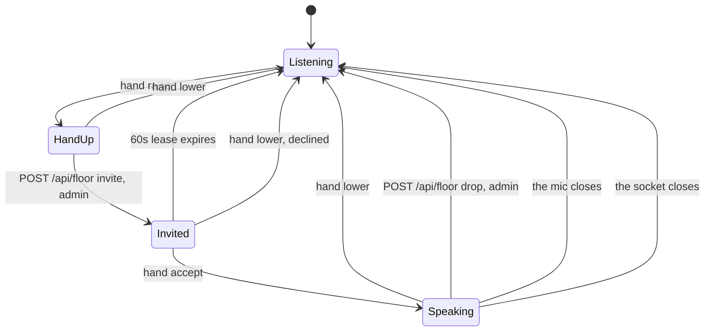
```mermaid
stateDiagram-v2
    [*] --> Listening
    Listening --> HandUp: hand raise
    HandUp --> Listening: hand lower
    HandUp --> Invited: POST /api/floor invite, admin
    Invited --> Listening: 60s lease expires
    Invited --> Listening: hand lower, declined
    Invited --> Speaking: hand accept
    Speaking --> Listening: hand lower
    Speaking --> Listening: POST /api/floor drop, admin
    Speaking --> Listening: the mic closes
    Speaking --> Listening: the socket closes
```

`hand {lower}` does three jobs (withdraw, decline, come down) because they are
one intent, and which of the three it is depends only on state the station
already holds. Three verbs would be three chances for a client to pick the
wrong one, and the worst of those is a guest pressing "leave" and staying on air.

`hands` is the one frame the station volunteers to a subset of its sockets, for
the wish book's reason: a raised hand is a request addressed to whoever runs the
decks, not an announcement to the room. Put it in front of everybody and it
becomes a queue the room can see, which is a social cost paid by the shyest
person in it. `floor.invited`, by contrast, *is* broadcast: a room that can see
somebody being brought up reads the pause before a voice for what it is.

The mic follows the floor asymmetrically, and both halves are deliberate.
Somebody coming up **opens** the mic, because the room has to be ducked before
their first word. Standing a guest down does **not** shut it, because you will
nearly always say something after them, and un-ducking between their last word
and your first is a swell of music in the middle of a sentence. The mic closing
*does* take the floor with it, and that half is not optional: a shut mic is an
un-ducked room, and the commonest way this happens is a lapsed lease after a
console died.

`lib/sound-check.ts` is a gate rather than advice, and it is the one thing
standing between a raised hand and a live microphone: a laptop playing the
station out loud with an open microphone in front of it sends the room a smeared
copy of the record it is already playing, and then a howl.

### The co-host: a second person at the decks

A co-host can **talk**, **decide what plays next** and **move the current record
along**. They cannot end the session, upload anything, mute anybody, empty the
queue, put a different record on, seek inside one, or set how far the music
ducks. Not because the page declines to draw those buttons: the station refuses
them to that credential.

```mermaid
stateDiagram-v2
    [*] --> Stranger
    Stranger --> HoldsKey: POST /api/cohost/session with the key
    note right of HoldsKey
        The cookie says this browser MAY co-host.
        Opening the page in a taxi should not
        put anybody in front of the room.
    end note
    HoldsKey --> Seated: POST /api/cohost/seat, action take, naming a socket
    Seated --> Seated: action renew, every few seconds
    Seated --> HoldsKey: action leave
    Seated --> HoldsKey: 30s lease lapses
    Seated --> HoldsKey: the socket closes
    Seated --> HoldsKey: the session ends
    HoldsKey --> Stranger: DELETE /api/cohost/session
```

The `socket` field is the crux. The cookie says *may this browser co-host*; the
id says *which connection is it*, which a cookie cannot carry and which the
console needs in order to offer a microphone. The station checks both and
refuses an id that never presented a co-host key on its own upgrade, or anybody
holding a seat could put an arbitrary listener on the air by guessing an id and
the room would hear whoever was really on that socket.

`DELETE /api/cohost/session` deliberately does not stand anybody down: it
carries a cookie and no connection, so it cannot tell whether the browser
sending it is the one currently on air, and a stale tab signing itself out would
otherwise take a co-host off the air mid-sentence from another device.

A guest and a co-host look alike from outside (both are a second voice arriving
over WebRTC) and are opposite in every rule that matters:

| | Guest (`Floor`) | Co-host (`CoHost`) |
|---|---|---|
| How they get up | Raises a hand, is invited | Arrives holding a key, seats themselves |
| Who decides | The decks | They do |
| Mic closing | Stands them down | Changes nothing |
| Lasts | A segment | The evening |

The last row forces them apart. A co-host works push-to-talk, so the mic closes
at the end of every sentence; a seat wired to the floor would throw them out of
it every time they stopped talking.

The co-host surface is its own document and its own bundle for a reason that is
about the device rather than tidiness: the station's bundle carries a globe, a
gramophone and three.js, and the console carries the whole desk. Neither is what
you want to hand somebody on a phone in a kitchen who has to press one button in
the next four seconds, on a mobile connection, over an evening, on a battery.

---

## Session lifecycle

A session is a stretch of time the station is on air, opened and closed by
whoever runs the decks. It used to be a run of the process, which meant a deploy
silently ended the evening and a restart silently began a new one. The station
now comes up **off air**.

```mermaid
stateDiagram-v2
    [*] --> OffAir: process starts
    OffAir --> Live: POST /api/session, action start, with a kind
    Live --> OffAir: POST /api/session, action end
    Live --> OffAir: process shuts down (session closed quietly)

    state Live {
        [*] --> Set
        [*] --> Talk
        note right of Set
            kind is chosen when the station goes on
            and cannot be changed afterwards: changing
            it halfway would rewrite what the room was
            told when they walked in.
        end note
    }
```

Going live clears **nothing**: queueing a set up and then opening the doors is
the ordinary way to start an evening. Ending a session clears a great deal, and
the dividing line throughout is *is this a claim about tonight, or a setting
belonging to whoever runs the decks*:

| Ends with the session | Survives it |
|---|---|
| The decks stop, the queue is emptied | The duck depth (`duckTo`) |
| Mutes, padding | The transition length (`blendMs`) |
| The mic, the floor (hands included), the seat | The announced next session |
| Chat, wishes and play history are forgotten | Every credential, which lives in config |
| **The entire library**: every track row, file, artwork and lyrics row | Uploads made *after* ending, which land in an already-empty library |

A mute set in October reappearing next Saturday is a bug; your own duck depth is
a setting. The library wipe is the strongest form of the same principle: the
station is an evening, not an archive, so the disk holds tonight and never
everything. It is fire-and-forget with errors logged, because an air change must
never be able to fail on housekeeping.

While off air, `say`, `wish` and `hand` are refused with `off_air`, opening the
mic is refused, and taking the co-host seat is refused. Moving the duck fader is
not, because setting up before the doors open is ordinary and a depth is not a
claim about a broadcast.

`GET /api/session` is deliberately open. Whether there is a station tonight is
the first thing a listener's page needs, it is not a secret, and it arrives
unasked on the socket anyway. What is behind the gate is changing it.

---

## Uploads, library and lyrics

```mermaid
flowchart TB
    Up["POST /api/upload<br/>multipart, admin"] --> Tmp["stream to tmp/"]
    Tmp --> Parse["music-metadata parses the container"]
    Parse -- "not audio, or unsupported" --> R415["415, discard"]
    Parse -- "over MAX_UPLOAD_BYTES" --> R413["413, discard"]
    Parse --> Hash["SHA-256 of the content"]
    Hash --> Dup{"already in tracks?"}
    Dup -- yes --> R409["409 with the existing track"]
    Dup -- no --> Move["move into audio/ named by hash<br/>write artwork/ named by hash"]
    Move --> Row["INSERT INTO tracks"]
    Row --> R201["201 {track}"]
    Row -.-> Errand["background: LyricsService asks LRCLIB"]
    Errand -.-> LRow["INSERT INTO lyrics"]
```

The declared `Content-Type` is a hint, never the gate: the file is only moved
out of `tmp/` once `music-metadata` confirms it is a container the station can
serve. Storing under the content hash makes re-uploading the same track a no-op
rather than a second copy.

Lyrics are looked up once per track, at upload time, and written down, so the
station asks the archive one time rather than once per listener.
`GET /api/lyrics/:trackId` is **read-through**: the upload's errand usually got
there first, but a track that went on air seconds after landing (or one whose
errand lost the network) sends the first listener who asks back to the archive
rather than going without. The service memoises hard enough that a full room
asking at once still costs one outbound request. A track nobody could find keeps
no row, so a restart is allowed to ask again.

On the client, the bright line lands on the ear's line with no machinery of its
own: `lib/lyrics.ts` reads `expectedPositionSeconds` off the server clock, which
is the same "now" everything else already agrees on.

---

## The podcast archive

Everything else in this project is about tonight. A session ends and takes its
tracklist, its chat and its wish book with it, and the library is emptied down
to the last file — the station is an evening, not a back catalogue. The archive
is the deliberate exception, and every structural decision about it follows from
being the one thing here meant to still be true in a year.

It lives at `/podcast`, a fifth document with its own bundle:

| | The station | The archive |
|---|---|---|
| Address | `/listen`, views on the fragment | `/podcast/<slug>`, real paths |
| Who may read | behind the door on a private station | anyone, always |
| Lifetime | deleted when the session ends | kept |
| Clock | everyone inside the same second | yours; scrub it, nobody else is there |
| Bundle | globe, gramophone, three.js | 25 kB, none of that |

**Why a separate document.** The same reason the co-host's page is one: what the
bundle has to carry. This is the page strangers arrive at cold, from a link in a
message, usually on a phone, and the station's bundle carries a globe and a
gramophone that have nothing to do with reading show notes and pressing play.

**Why paths rather than fragments.** The station is one document deciding what
to show from `location.hash`, which is right for an application behind a door
whose views nobody shares. An episode is the opposite: it is public, it is meant
to be pasted into a message, and it is the one address in this project a crawler
should read. A fragment never reaches the server, so `/listen#podcast/12` could
never have a title of its own or appear in a sitemap. The cost is that
client-side routing now owns the back button, which `Podcast.tsx` handles with
`popstate` and a `pushState` on every navigation.

**Why its own table.** `episodes` shares nothing with `tracks`. The columns
could have been made to agree; what could not is the lifetime. Filing an episode
under `tracks` would mean an archive that deleted itself the first time somebody
pressed "end broadcast" — see the `air.on('change')` handler in `app.ts`, which
calls `emptyLibrary`. There is a test named for exactly this
(`test/podcast.test.ts`, "the archive outlives the evening"), and it is the
assertion the whole file exists for.

### Drafts, and what a stranger may know

`status` is `draft` or `published`, and draft is the default: an episode is an
audio file, a poster and five fields typed into a form, and the gap between the
upload finishing and the description being right is exactly the window in which
somebody would otherwise find it.

A draft is invisible to the open reads at every level. It is missing from
`GET /api/episodes`, and its own address answers **404 rather than 403** — a 403
on a slug confirms the slug is real, and whether an unpublished episode exists is
not a stranger's business. An admin asking directly gets it, so "View" in the
console lands on the real page rather than a 404 for something visible in the
list beside the button.

### Addresses

A slug is derived from the title, folded to ASCII (`Sé` becomes `se`) because a
slug is read off a screen and typed into a phone, and percent-escapes in a
shared link are how an address stops being something anybody can repeat out
loud. Collisions count up — `leaving-johannesburg-2` — rather than taking a
random suffix, because these are read by people.

The slug **follows the title only while the episode is a draft**. Once it is
published it is frozen: a published episode has been sent to people, and
re-slugging it to fix a typo would break every link already in a message thread,
which is worse than an address that reads slightly wrong. Correcting a title
before publishing corrects the address too, which is the moment anybody actually
wants that.

### The poster is exactly 1080x1350

The one place this station is strict about an image, and the reason is the grid:
the cards are a fixed 4:5, and a poster that is not that ratio is either
letterboxed or cropped with no say from whoever chose the framing. Both look
like a bug on the page whose whole job is showing artwork.

Dimensions are read from the file's own header — `lib/poster.ts` parses PNG,
JPEG and WebP by hand rather than adding `sharp`, which is 30 MB of platform
binaries in the server image to read twenty bytes. The refusal names the size
received, and the console checks the same thing in the browser before sending,
because finding out after eighty megabytes of audio have crossed a phone's
connection that the poster was square is a genuinely bad minute.

The session poster in `routes/schedule.ts` deliberately has **no** such rule: it
is whatever somebody made in a hurry an hour before the doors open, and refusing
it then would be the tool getting in the way of the night. The two share
`lib/poster.ts` for format sniffing and the byte ceiling, and disagree only
about size.

### One viewport, two columns

Every page of the archive is exactly one viewport tall and never scrolls
itself. On a desk each is two columns; below 900px the same regions stack.
What scrolls is always a named region *inside* the layout — the card grid, the
show notes, each of the console's two columns — so the things that orient you
stay where they were:

| Page | Left | Right | What scrolls |
|---|---|---|---|
| `/podcast` | the words, and the footer | the cards | the cards |
| `/podcast/<slug>` | the artwork | title, transport, notes | the notes, under a transport that does not move |
| `/podcast#admin` | the upload form | the archive it changes | each column, on its own |

Two details carry this, and both are easy to lose:

- **`100dvh`, not `100vh`.** `vh` is the *largest* the viewport ever gets — it
  does not shrink while a phone's address bar is showing — so a `100vh` layout
  on iOS puts its bottom edge under the browser chrome, which on this page is
  the play button. `100vh` is still declared first, as the fallback for
  anything that has not heard of `dvh`, where being slightly too tall is the
  better failure.
- **`min-height: 0` on every pane.** A grid or flex child defaults to
  `min-height: auto`, meaning "as tall as my content" — so a scrolling region
  inside one makes the *parent* grow instead of scrolling, and the page quietly
  becomes taller than the viewport again. This is the single declaration that
  the whole arrangement rests on.

The layout is pinned by a browser check rather than by eye: every view at six
viewport sizes, asserting the document does not scroll in either axis, that the
play button is inside the viewport, and — the half that matters more — that
each scrolling region actually *reaches* its last card, paragraph and row.
Fitting the screen by clipping content unreachably would pass the first
assertion and fail the second.

### Where the audio lives, and how it gets there

An hour of conversation is a 500 MB to 1 GB master, and neither end of that
works naively: it will not fit in one request, and no listener should download
it. Two independent pieces solve those.

**The upload never touches this server.** The console asks for a chunked
upload, gets a presigned URL per 8 MiB part, and PUTs each one straight to
Cloudflare R2. Railway sees the metadata and nothing else. A part that fails is
retried on its own — dropping at 90% costs the last 8 MiB, not 450 — and
cancelling aborts the upload so the parts already sent are not left in the
bucket being billed for.

| | Through the server | Direct to R2 |
|---|---|---|
| 500 MB crosses Railway | yes | no |
| Proxy body limit applies | yes | no |
| Drop at 90% | starts over | resumes at the last part |

**Listeners get a re-encode, not the master.** After the upload answers, a
background job pulls the master, encodes it to 96 kbps mono AAC with
`faststart`, and points the episode at that. Measured on a real hour:

| | Size |
|---|---|
| master (1 hr, 24-bit/48k stereo WAV) | 988.8 MB |
| serving copy (96 kbps mono AAC) | 42.0 MB |
| what a listener downloads | **95.8% less** |

The master is **kept**, under `masters/`, and never served. It is the thing that
cannot be recreated: re-encoding from a lossy copy later, for a different
bitrate or codec, is a generation of quality nobody gets back.

The encode is an *errand*, not a step. The episode is created pointing at the
master, so it is playable the instant the upload answers, and every later state
is an improvement on that or a note explaining why there wasn't one:

| `transcode_status` | What it means | Plays? |
|---|---|---|
| `pending` | the master is the serving copy; the encode is queued | yes, large |
| `ready` | the small copy is the serving copy | yes |
| `failed` | ffmpeg refused this file; the master is served | yes, large |
| `none` | this station has no ffmpeg | yes, large |

There is deliberately no state in which an episode exists and cannot be played.

**Neither piece requires R2.** With the five `R2_*` variables unset the archive
lives on the storage volume and *the same chunked protocol* runs against this
server instead — `lib/store.ts` implements begin/sign/put/complete/abort against
a directory. That is not a degraded mode; it is what `docker compose` and
`npm run dev` do, and it means the upload path exercised in development is the
one production runs. The only thing the console does differently is which URL it
PUTs a part to, and it is handed that URL either way.

Two details that are easy to get wrong:

- **The bucket needs `ExposeHeaders: ["ETag"]` in its CORS policy.** Without it
  every part uploads successfully and the browser cannot read the receipt, which
  presents as an upload that reaches 100% and then fails. The upload says so by
  name when it happens.
- **The content hash is computed in the browser**, because the server never sees
  the bytes. `crypto.subtle` is one-shot and cannot hash a gigabyte without
  holding it in memory, so `lib/episodes.ts` carries a small incremental
  SHA-256 — checked against the platform's own implementation at every block and
  padding boundary, and for independence from the slice size, since a hash that
  depended on `PART_SIZE` would silently break dedupe the day that constant
  changed.

### The player

Apple Music's transport, with the departures a podcast needs: the outer buttons
are **skips** (15 back, 30 forward) rather than track changes, because there is
nowhere to go and the reasons are "I missed that" and "get past this bit"; and
the remaining time counts down negative, which is the question somebody deciding
whether to start an hour actually has. How far each skip goes is in its label
and its tooltip rather than drawn inside the arrow — at 26px a two-digit number
inside a circle is a smudge, and the arrows already say which way they point.

Three things are deliberately absent, and the first two were built and then
removed. A **speed control**: it is a preference, and this is a page for
listening to one conversation rather than a client for getting through a
backlog. A **volume slider**: every device this runs on already has one that
works, and on iOS `audio.volume` is read-only, so the slider was inert on
exactly the devices where it cost the most room. A **queue**, for a different
reason — an archive is browsed rather than played through, and autoplaying the
next episode of a conversation because somebody let one finish is presumptuous.

The three glyphs are [Phosphor](https://phosphoricons.com), fill weight,
vendored inline from `phosphor-icons/core` (`assets/fill/`) with upstream's
paths untouched. The rest of the project uses Phosphor too, but through
`client/src/assets/icons/` as Figma exports loaded with ``, and that
could not work here: those files carry a hardcoded `#171717` or `white`, because
an `` has no access to the colour of the thing it sits in. These sit inside
buttons that change colour on hover and invert entirely on the play button, so
they are inline SVG keeping upstream's `fill="currentColor"`.

One thing to know if the skip icons are ever revisited: `skip-back` and
`skip-forward` are the *track* skip glyph, and these buttons do not change
track. Nothing is reachable by pressing one that the icon misrepresents — there
is no next episode from here — and the label and tooltip both carry the
duration. `arrow-counter-clockwise` is what a seconds-jump usually wears.

The play glyph gets **no optical nudge**, which is the opposite of the usual
advice: a triangle centred on its bounding box reads left of centre in a circle,
so it is normally pushed a few pixels right. Phosphor's `play-fill` already
carries that offset — the path spans 64..240 on a 256 grid — and adding the
customary correction on top pushes it visibly past the middle.

Position is remembered per episode in `localStorage`, restored on
`loadedmetadata` (seeking an element that does not yet know its duration is
ignored or clamped depending on the browser), and cleared within fifteen seconds
of the end — somebody who reached the outro has heard it, and restoring them to
59:57 is a bug with good intentions. It is kept in the browser rather than on
the server because the archive is public: a server-side position would mean the
station knowing what strangers listen to, which it has no reason to want.

### The blob

The shape behind the artwork is driven by **the actual audio**, not a keyframe
loop. An `AnalyserNode` is tapped off the playing element and every frame writes
three custom properties — `--level`, `--deform`, `--wobble` — from three bands
of the spectrum. A single amplitude would only ever make it bigger and smaller,
which reads as a volume meter; splitting it lets the *shape* change, so a vowel
and a consonant look different, which is the whole illusion.

A CSS-only version was the alternative and it looks wrong within about four
seconds of watching it, because it is plainly not listening: it keeps pulsing
through silences and sits still through a laugh.

The hazard to know about before touching `Blob.tsx`:
`createMediaElementSource` **permanently reroutes an element's audio through the
graph**. From that moment it reaches the speakers only via
`context.destination`, and a suspended context is not quiet audio, it is
silence. So the graph is built lazily on the first play — which is a click, and
therefore a gesture that can resume a context — never on mount. A browser that
refuses the graph gets audio playing normally and a blob that breathes on a slow
default; the sound is never sacrificed for the decoration. This is the same
trap, in a much smaller room, that `lib/audio-graph.ts` documents at length.

Under `prefers-reduced-motion` the blob stops entirely rather than slowing: it
is large, organic and continuous, which is precisely what that setting is for.
The card lift and brightness stay, because they say "this is the one you are
pointing at", which is information rather than decoration.

### The console

At `/podcast#admin`, behind the same password and the same signed cookie as the
decks — the same person, and a second credential would be a second credential to
lose. A **fragment** rather than a path, because every path under `/podcast/` is
an episode slug and a console at `/podcast/admin` would be competing with an
episode somebody could legitimately name "Admin". `slugify` refuses to mint
`admin` anyway; two locks, because a slug is permanent the moment somebody links
to it.

`PATCH` is genuinely partial, which is the opposite of what `PUT /api/schedule`
does with its text fields, and the difference is what the request is: announcing
a session is a form filled in from scratch each time, while this is a list with
a publish button on every row. A handler that cleared the show notes because the
caller only wanted to flip the status would be a trap.

---

## Configuration reference

Server variables, read once at boot by `loadConfig`.

| Variable | Default | Purpose |
|---|---|---|
| `HOST` | `0.0.0.0` | Bind address. |
| `PORT` | `3000` | Injected by Railway in production. |
| `AUDIO_STORAGE_DIR` | `audio_storage` | Root of everything the station owns. |
| `DB_PATH` | `<storage>/chunky.sqlite` | Override only if the database must live elsewhere. |
| `ADMIN_PASSWORD` | the built-in house key | Guards the decks, and signs admin cookies. Changing it signs everyone out. |
| `STATION_KEY` | unset, meaning an open station | Put a door on listening. Rotating it ends every invite at once. |
| `STATION_OPEN` | unset | Obsolete and accepted as a no-op. |
| `CO_HOST_KEY` | derived from `ADMIN_PASSWORD` | Rotate the seat without changing the password. |
| `MAX_UPLOAD_BYTES` | 157286400 (150 MiB) | Upload ceiling. |
| `LRCLIB_BASE_URL` | `https://lrclib.net` | An address, not a credential. Point it at a mirror if needed. |
| `LOG_LEVEL` | `info` | Set to `debug` to log every relayed ICE candidate while diagnosing a voice. |
| `STUN_URLS` | `stun:stun.l.google.com:19302` | Comma-separated. Empty string means ask nobody, which works on a LAN and nowhere else. |
| `TURN_URL`, `TURN_USERNAME`, `TURN_CREDENTIAL` | unset | A relay you hold a password for (coturn). All three or none; half a relay is refused at boot. |
| `TURN_KEY_ID`, `TURN_API_TOKEN` | unset | Cloudflare's relay, which hands out expiring credentials rather than holding one. Both or neither. |
| `CLIENT_DIR` | unset | Set only in the single image. Unset means something else owns the front door. |
| `TRUST_PROXY` | `true` | `true`, `false`, a hop count, or a comma-separated list of addresses or CIDRs. The sign-in throttle is keyed on `request.ip`. |

Compose-level variables (`.env` at the repository root): `WEB_PORT` (18173),
`SERVER_PORT` (13000), plus pass-throughs for the above. The published ports are
deliberately not 5173 and 3000, so the container stack and a dev server can be
up at the same time without fighting over a port.

`STUN_URLS` is the one place this station reaches somewhere it was not
configured to. What crosses it is a browser's own address and nothing else: no
audio, no identity, nothing about the station or what is playing on it.

---

## Running the station

### Docker, the whole station from one command

```bash
./start.sh              # write .env if missing, build what changed, wait for health
./start.sh --build      # the same, but pull fresh base images first
./start.sh logs         # follow them
./start.sh status       # what is up, and how healthy
./start.sh stop         # stop, keeping the library
```

The script generates an `ADMIN_PASSWORD` into `.env` on first run, checks the
published ports and names any that are taken (rather than letting Docker fail
with a container id), and waits until the station answers before printing where
it is: `http://localhost:18173/listen` to listen, `/listen#admin` to run it, and
the bare `http://localhost:18173` for the page describing the station.

`stop` and `--build` both leave the volume alone. To throw the library away:
`docker compose down && docker volume rm chunky-fm_data`.

### Without Docker

```bash
cd server && npm install && cp .env.example .env && npm run dev   # :3000
cd client && npm install && npm run dev                           # :5173
```

Vite proxies `/api`, `/ws` and the crawl files through to the server, so the
client only ever talks to its own origin, which is what lets it ship unchanged
into the container.

### Driving it from a shell

```bash
# The password directly, which is what the QA scripts and curl use
curl -H "Authorization: Bearer $ADMIN_PASSWORD" -F "file=@track.mp3" \
     http://localhost:3000/api/upload

curl -H "Authorization: Bearer $ADMIN_PASSWORD" -H 'content-type: application/json' \
     -d '{"action":"start","kind":"set"}' http://localhost:3000/api/session

curl -H "Authorization: Bearer $ADMIN_PASSWORD" -H 'content-type: application/json' \
     -d '{"trackId":1}' http://localhost:3000/api/queue

# Or exchange it for a cookie once
curl -c jar -X POST -H 'content-type: application/json' \
     -d "{\"password\":\"$ADMIN_PASSWORD\"}" http://localhost:3000/api/admin/session
curl -b jar -H 'content-type: application/json' \
     -d '{"action":"skip"}' http://localhost:3000/api/playback
```

Queueing onto an **idle** station starts that track immediately: with nothing on
the decks there is nothing to wait for. A *paused* station stays paused, because
that is the admin's decision rather than an empty deck.

---

## Testing and CI

### Unit tests

`vitest` in both workspaces. The server suite exercises the domain objects, the
protocol parser, every route's gate, and the socket layer against a real
`ws` server. The client suite covers everything in `lib/`, which is why so much
arithmetic lives there rather than inside components: position, clock offset,
drift response, chat and history merging, availability folding, decking, the
mixer's routing, hand refusals, schedule wording and the invented landing-page
session.

### Browser QA

Sync, and anything else that only happens in a real browser, is what unit tests
cannot judge. Sixteen scripts drive real Chrome through `playwright-core`.

```bash
cd client
npm run verify:sync      # two listeners joining at different times stay together
npm run qa:playback      # seeks, pause/resume/seek/stop, track changes
npm run qa:transition    # one record becoming the next, in two browsers at once
npm run qa:reconnect     # kills the server underneath a listener and restarts it
npm run qa:offline       # loads against a dead station, then takes one away
npm run qa:presence      # three listeners watch each other arrive and leave
npm run qa:chat          # they talk; one joins late; one tries to speak as another
npm run qa:chat-refusal  # types faster than the room will take
npm run qa:wishes        # one asks, the room hears nothing, the admin marks it off
npm run qa:history       # Earlier fills as tracks change, and survives a reload
npm run qa:admin         # sign in, upload, queue, reorder, drive the decks
npm run qa:mic           # two listeners duck together, a third arrives mid-break
npm run qa:soundcheck    # opens a real microphone and watches the meter
npm run qa:voice         # a real voice, decks to listener, measured at the far end
npm run qa:callin        # a caller refused for being on speakers, and one who passes
npm run qa:cohost        # the seat on a 390x844 viewport, push-to-talk, hand blend

npm run qa:all           # all of them, restarting the station between each
```

Prefer `qa:all`. Run back to back by hand they interfere with each other: the
roster, the floor, the chat and the evening's history all live in the
session, and most scripts open by asserting on an empty one. `qa:all` restarts
the station before each script, which is the only thing that gives them the
empty room they are written against.

They read `CLIENT_URL`, `API_URL`, `ADMIN_PASSWORD`, `TRACK_ID`,
`OTHER_TRACK_ID` and `CHROME_PATH` from the environment. Four of them start and
stop the server themselves, so build it first (`cd server && npm run build`):
telling a browser it is offline does not drop an established WebSocket, so
taking the station away is the only way to test a disconnection for real.

Between them these caught five bugs that every unit test passed straight
through; see `docs/qa-notes.md`.

### CI

```mermaid
flowchart LR
    Push["push to master<br/>or a pull request"]

    subgraph Checks["checks (matrix)"]
        C1["client and server<br/>Node 20 and Node 22<br/>typecheck, unit tests, build"]
    end
    subgraph Sync["sync check"]
        S1["two listeners join a real server<br/>over real websockets at different times<br/>and must compute the same position"]
    end
    subgraph Stack["docker compose stack"]
        D1["build both images, up with --wait<br/>so healthchecks must pass"]
        D2["drive the front door through nginx:<br/>/, /listen, /welcome, /how-it-works,<br/>invite forwarding, 404s, og.png"]
        D3["library behind the door,<br/>admin sign-in refuses then accepts"]
    end
    subgraph Image["single image"]
        I1["build the root Dockerfile,<br/>same front-door assertions over one port"]
        I2["a mistyped API route must not<br/>come back as HTML with a 200"]
    end

    Push --> C1
    Push --> S1
    Push --> D1
    Push --> I1
```

Two Node versions because `server/package.json` claims `>=20.12` while the
containers ship 22; testing only one leaves the other a guess. The two Docker
jobs exist because the front door's rules live in three places and a copy nobody
checks is a copy that drifts.

CI does not run the browser QA: it needs a real Chrome and a library with a few
minutes of audio in it, neither of which a runner has. That is worth remembering
when a change touches seeking or reconnection, because the suite that would
catch it is the one nobody is running for you.

Dependency updates arrive through `.github/dependabot.yml`: weekly for both
lockfiles with minor and patch bumps grouped into a single pull request, monthly
for the action versions pinned in the workflow.

---

## Deployment

### Railway

`railway.json` points at the root `Dockerfile` and sets three things that are
not defaults and are all load-bearing:

| Setting | Why |
|---|---|
| `numReplicas: 1` | Playback state lives in memory, by design. Two replicas is two stations disagreeing with each other, with listeners randomly split between them. This is the setting to re-check first if the station ever starts behaving impossibly. |
| `sleepApplication: false` | A sleeping instance drops every websocket, and the websocket *is* the station. |
| `healthcheckPath: /health` | So a deploy that comes up broken is rolled back rather than served. |

The one thing the file cannot do is **mount a volume**. Do that in the dashboard,
mounted at `/data`, which is what `AUDIO_STORAGE_DIR` is set to in the image.
Without one the filesystem is ephemeral and every deploy silently wipes the
library and `chunky.sqlite`, and because the rows name files, the two only mean
anything together.

Set **both** `ADMIN_PASSWORD` and `STATION_KEY` as service variables. Neither is
required to boot, and that is exactly why a deployment on the open internet has
to set them: otherwise the decks are behind a code that ships in this repository,
and behind the same code handed to anyone invited to listen. Leave `TRUST_PROXY`
alone, because Railway's edge is in front and the sign-in throttle has to read
the caller through `X-Forwarded-For` rather than pacing the whole internet as
one.

### Trying the single image locally

Worth doing before a deploy, because it is the artifact that actually ships:

```bash
docker build -t chunky-fm/all-in-one .
docker run --rm -e ADMIN_PASSWORD=whatever -p 3000:3000 chunky-fm/all-in-one
```

The station is then at `http://localhost:3000`: landing page at `/`, the station
at `/listen`, `/listen#admin` to run it. Add `-v chunky:/data` to keep the
library across runs.

---

## System invariants

The properties the rest of the design is arranged to protect. Each is worth
checking against any change that touches its area.

| Invariant | Where it is enforced | Failure if broken |
|---|---|---|
| The socket mutates nothing | `parseClientMessage` refuses command-shaped frames by name; every mutation sits behind a gate on an HTTP route | An unauthenticated command channel to authorise, and get wrong |
| Authorship is the server's answer | `say`, `wish` and `hand` carry no author; `signal` has `from` stamped server-side | A client could sign somebody else's name, or pose as the decks |
| Exactly one replica | `railway.json`, and playback living in memory | Two stations disagreeing, listeners split at random |
| The station clock is the only clock | `playback.now()` stamps plays, leases, air and pong | Two timebases disagreeing about one instant |
| The three front doors agree | nginx, Vite middleware, `doorway.ts`, checked by two CI jobs | Rules that only fail in production |
| A published slug never moves | `PATCH /api/episodes/:id` re-slugs only while `status = 'draft'` | Every link already sent to somebody breaks on a typo fix |
| One code path for join and rejoin | Presence hangs off `connected`, and every list merges by id | Duplicated chat lines, listeners nobody can see |
| Nothing is optimistic | Chat, wishes and raised hands all render only what came back | A refused message left on screen looking sent |
| A note cannot break what it notes | `plays.track_id` has no foreign key; the lyrics errand is fire-and-forget; the library wipe is caught and logged | An admin command answering 500 after the track already changed |
| Domain separation between cookies | Three HMAC labels in `lib/auth.ts` | On an unconfigured station, a listener cookie would verify as an admin cookie |
| Ephemeral state ends with the session | The `air` change handler in `app.ts` | A mute from October silencing somebody next Saturday |
| The archive outlives the session | `episodes` shares no table and no directory with `tracks`; pinned by a test named for it | Ending a broadcast would delete the entire back catalogue |
| An episode is always playable | `audio_key` is set to the master at creation; the encode only ever replaces it | An episode that exists with no audio behind it |
| A master is never thrown away | Only the derived copy is replaced; deletion removes both keys | A re-encode at a different bitrate would be a second generation of loss |
| Voices never hear themselves | One mix-minus bus per voice in `lib/mixer.ts` | Delayed auditory feedback, which stops people mid-sentence |

---

## Repository layout

```
.
├── Dockerfile                 single image: Fastify serves API, /ws and the client
├── docker-compose.yml         two containers plus a volume
├── railway.json               one replica, no sleeping, health at /health
├── start.sh                   build, wait for health, report where the station is
├── PLAN.md                    the original design decisions
├── docs/                      design notes and build logs
│   ├── broadcasting.md        the mic and the voice, as designed
│   ├── broadcasting-build.md  how that was actually built
│   ├── call-in.md             the floor, as designed
│   ├── call-in-build.md       how that was actually built
│   ├── being-found.md         the crawl surface and the public pages
│   ├── experiments.md         things tried, and what came of them
│   └── qa-notes.md            bugs the browser suite caught that units did not
├── server/
│   ├── src/
│   │   ├── app.ts             composition root: builds and wires everything
│   │   ├── index.ts           config, database, listen
│   │   ├── config.ts          the environment, and the key derivations
│   │   ├── db.ts              schema, migrations, session helpers
│   │   ├── realtime.ts        the WebSocket surface
│   │   ├── protocol.ts        every frame, in and out, plus the parser
│   │   ├── station.ts         decks plus queue plus the advance timer
│   │   ├── playback.ts        track, startedAt, pausedAt, outgoing
│   │   ├── queue.ts           entries addressed by id
│   │   ├── transition.ts      blendMs, and the clamp
│   │   ├── air.ts             on air, since, kind
│   │   ├── schedule.ts        the next session, announced
│   │   ├── mic.ts             leases per holder, duck depth
│   │   ├── floor.ts           hands, invitations, the speaker
│   │   ├── cohost.ts          the seat
│   │   ├── presence.ts        socket to nickname
│   │   ├── chat.ts            messages, and the token bucket
│   │   ├── wishes.ts          the wish book
│   │   ├── history.ts         the play log
│   │   ├── mutes.ts           nicknames asked to stop talking
│   │   ├── padding.ts         heads added to the tally
│   │   ├── lyrics.ts          LRCLIB, memoised
│   │   ├── turn.ts            Cloudflare relay credentials, minted and shared
│   │   ├── lib/               auth, doorway, storage, errors, library, track,
│   │   │                      episode, poster, store (R2/disk), transcode,
│   │   │                      publish (the background encode)
│   │   └── routes/            one plugin per surface
│   └── test/                  vitest, including a real ws server
└── client/
    ├── index.html             the station
    ├── landing.html           the page in front of it
    ├── cohost.html            the co-host surface
    ├── how-it-works.html      prose, no bundle
    ├── podcast.html           the archive: the grid, the player, the console
    ├── nginx.conf             the front door, copy one of three
    ├── vite.config.ts         entry points, dev proxy, front door copy two
    ├── src/
    │   ├── App.tsx            the station page
    │   ├── AdminPanel.tsx     the console
    │   ├── CallIn.tsx         the listener's end of a call
    │   ├── cohost/            the third document, phone-sized
    │   ├── landing/           the public page and its ported components
    │   ├── podcast/           the archive: TiltCard, EpisodeGrid, Player, Blob, Console
    │   ├── hooks/             everything stateful
    │   ├── lib/               everything pure, and therefore tested
    │   └── *.css              tokens, shared objects, station, landing, podcast
    ├── scripts/               the browser QA suite
    └── test/                  vitest over lib/
```
